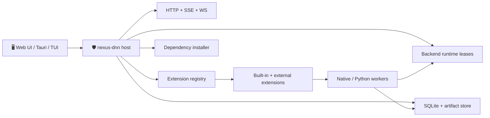
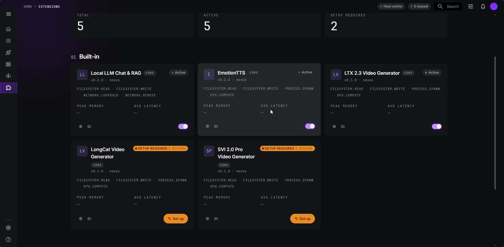
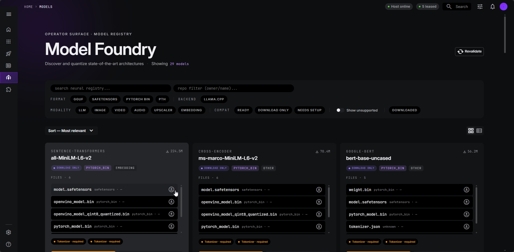
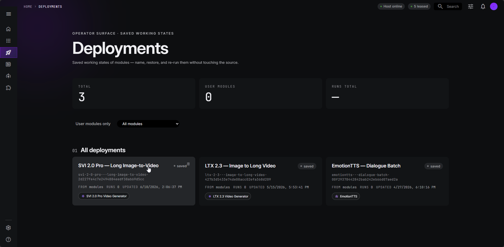
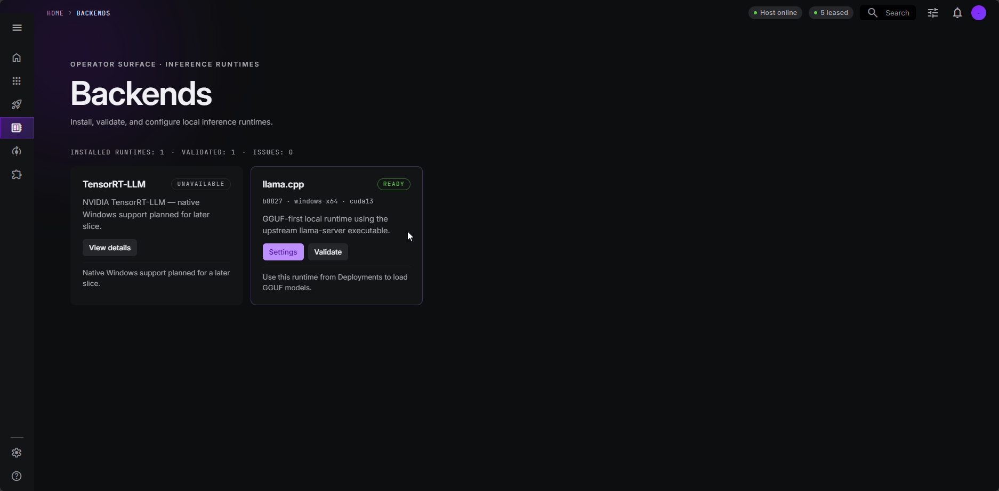
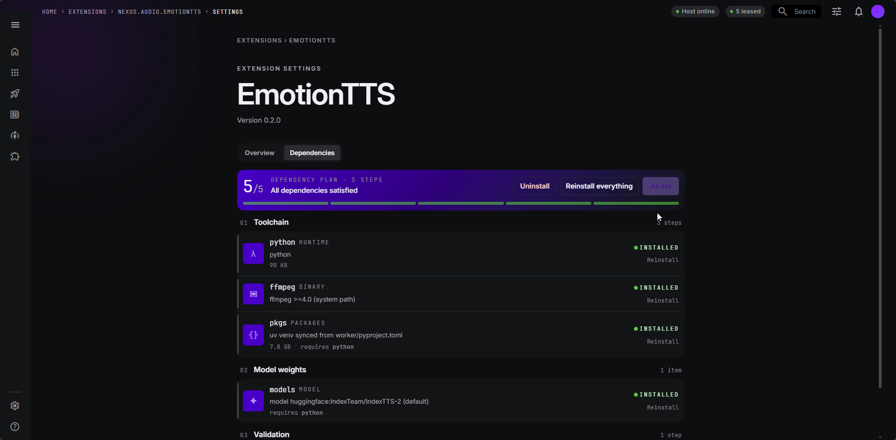
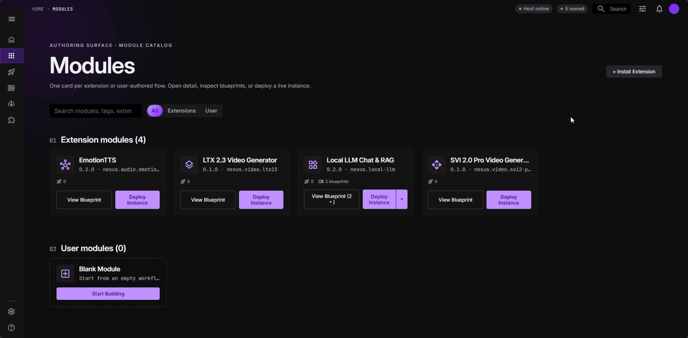
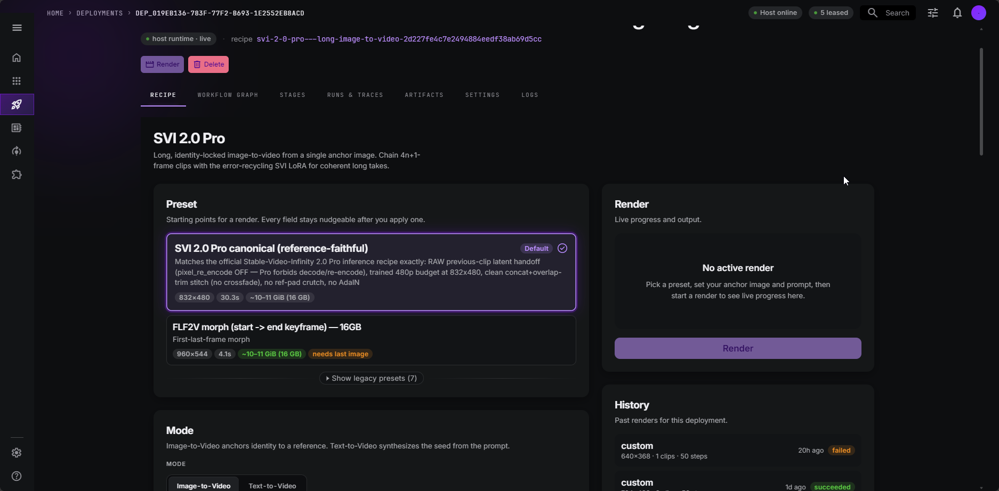
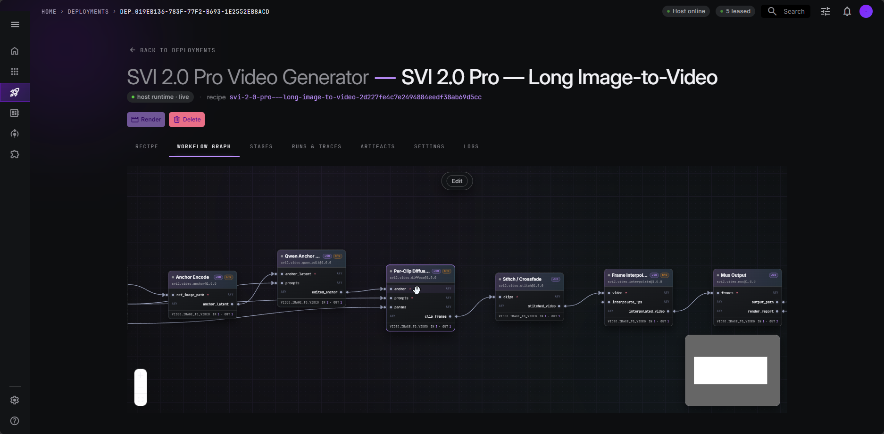
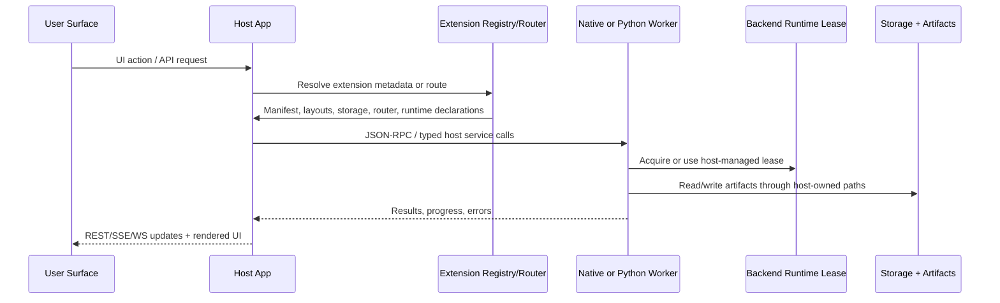

# nexus-dnn

> Local-first AI orchestration with a host-authoritative Rust runtime, extension-driven capabilities, and first-party support for local LLM, audio, and video workflows.

<p align="center">
  
  
  
  
  <br>
  
  
  
  
</p>

## 📋 Table of Contents

- [🚀 Run It Locally First](#-run-it-locally-first)
- [🧩 Supported Capabilities](#-supported-capabilities)
  - [🎬 Video Generation](#-video-generation) — SVI2-Pro · LongCat · LTX-2.3, RIFE frame-gen, RTX ×2/×4 upscale
  - [🧠 LLM Inference](#-llm-inference) — llama.cpp + speculative decoding (MTP)
  - [🎤 Voice Generation (EmotionTTS)](#-voice-generation-emotiontts) — IndexTTS-2 emotion vectors + storyboard
  - [🎨 Image Generation](#-image-generation) — Stable Diffusion · FLUX (coming soon)
- [✨ What nexus-dnn Is For](#-what-nexus-dnn-is-for)
- [🧭 System At A Glance](#-system-at-a-glance)
- [🖼️ UI Screenshots](#-ui-screenshots)
- [🔌 Built-in Extensions](#-built-in-extensions)
- [📚 Documentation Map](#-documentation-map)
- [🛣️ Future Roadmap](#-future-roadmap)
- [📄 License](#-license)

## 🚀 Run It Locally First

### 1. Install prerequisites

| What | Minimum |
|------|---------|
| Rust | stable |
| Node.js | 20+ |
| pnpm | 8+ |
| `uv` | latest recommended |

`uv` matters because several built-in extensions use host-managed Python environments.

### 2. Clone and start

```bash
git clone <your-fork-or-origin-url> nexus-dnn
cd nexus-dnn

# Host only: browser UI served from the embedded frontend bundle
cargo host

# or

cargo run -p nexus-core --bin nexus-dnn
```

Open [http://127.0.0.1:3000](http://127.0.0.1:3000).

### 3. Verify the host is healthy

```bash
curl http://127.0.0.1:3000/api/v1/health
```

Expected shape:

```json
{
  "data": {
    "status": "ok",
    "details": {
      "...": "additional live health fields may appear here"
    }
  },
  "meta": {
    "timestamp": "2026-06-12T00:00:00Z"
  },
  "error": null
}
```

> `nexus-dnn` currently listens on `0.0.0.0:$NEXUS_PORT`, but local usage should still prefer `127.0.0.1`.

### 4. Useful local launch modes

| Goal | Command |
|------|---------|
| Host only | `cargo host` |
| Host + TUI | `cargo dev` |
| TUI drives host | `cargo dev-tui` |
| Desktop shell | `cd apps/web && pnpm install && pnpm tauri dev` |
| Rebuild embedded web app | `cd apps/web && pnpm install && pnpm build` |

The host serves the already-built web bundle from `apps/web/dist`, so frontend install/build is mainly for frontend or desktop-shell development.

## ✨ What nexus-dnn Is For

nexus-dnn is a local-first platform for running AI features as structured host-managed systems instead of ad-hoc scripts. The host owns process lifecycle, storage, installs, API routing, workflows, model/runtime leasing, and extension boundaries. Extensions add domain capability without taking control away from the host.

Today that means the repo can host:

- Local chat and RAG workflows
- Host-managed backend runtime leasing
- Emotional TTS pipelines
- Image-to-video and long-video generation flows
- Extension-owned UI surfaces mounted inside the host app

## 🧩 Supported Capabilities

Everything below runs **locally**, on a single consumer GPU, behind the same host-managed runtime-lease + model-store foundation.

| Capability | Engines | Highlights | Status |
|---|---|---|---|
| 🎬 **[Video Generation](#-video-generation)** | SVI2-Pro · LongCat · LTX-2.3 | Text→Video, Image→Video, **infinite length**, **RIFE** frame-gen, **RTX ×2/×4** upscale | 🟢 Stable |
| 🧠 **[LLM Inference](#-llm-inference)** | llama.cpp | **Speculative decoding via MTP**, GGUF, host-managed runtime leases | 🟢 Stable |
| 🎤 **[Voice Generation](#-voice-generation-emotiontts)** | IndexTTS-2 (EmotionTTS) | **8-axis emotion vectors**, **storyboard**, custom-voice upload | 🟢 Stable |
| 🎨 **[Image Generation](#-image-generation)** | Stable Diffusion · FLUX | Text→Image | 🟠 Coming soon |

---

### 🎬 Video Generation

> `nexus.video.svi2-pro` · `nexus.video.longcat` · `nexus.video.ltx23`

Generate video from a text prompt or a still image — then push it past what a single diffusion pass yields: **higher frame-rate** and **higher resolution**, all on a local GPU.

**Engines**

- **SVI2-Pro** — Stable Video Infinity 2.0 Pro (two SVI LoRAs over the Wan2.2-I2V-A14B dual-expert MoE). Does **both Image→Video and Text→Video**, with **infinite, cross-clip-consistent length**: clips are chained with rolling cross-fade + reference anchoring so the subject stays coherent across arbitrarily many segments. The fp8 e4m3fn base **fits in 16 GB of VRAM — or less**.
- **LTX-2.3** — fast image-to-video with host-managed runtime profiles. RTX 40 FP8, RTX 50 Blackwell FP8 (production) + RTX 50 NVFP4 (experimental). 16 GB-safe by default via external-segment rendering.
- **LongCat** — 13.6B DiT (UMT5-XXL text encoder, Wan 2.1 VAE) for text→video, image→video, and long-video continuations. FP8 e4m3fn path for 12–16 GB; BF16 path for 24 GB+.

**Post-processing stack — applies on top of any engine**

- 🌀 **RIFE frame interpolation (frame-gen)** — torch-RIFE (vendored IFNet HDv3) synthesizes in-between frames to multiply FPS (e.g. **16 → 48 fps**) for fluid motion, with no extra diffusion cost.
- 🔍 **RTX ×2 / ×4 upscaling** — NVIDIA Maxine RTX super-resolution on RTX GPUs upscales the output in a hardware-accelerated pass (e.g. 1216×768 → 2432×1536).
- ⚙️ Attention backends (SDPA / FlashAttention-2/3 / SageAttention) are auto-selected per GPU architecture + dtype.

**16 GB-friendly by design** — staged CPU offload, fp8 compute, and external-segment rendering keep peak VRAM under consumer-card budgets.

---

### 🧠 LLM Inference

> `nexus.local-llm`

Local large-language-model inference and chat, served through host-managed backend runtimes.

- ⚡ **Latest llama.cpp** backend with **speculative decoding via MTP (Multi-Token Prediction)** — a draft head proposes several tokens per step and the main model verifies them in one pass, for materially higher tokens/sec at identical output quality.
- 📦 **GGUF** models with quantization-aware install and an on-disk model store.
- 🛡️ **Host-managed runtime leases** — the host owns process lifecycle, VRAM budgeting, and idle reaping; the extension simply acquires a lease.
- 💬 Interactive chat threads with per-thread generation settings, model picker, and RAG workflows.
- 🎚️ Throughput knobs: KV-cache reuse, MoE offload, min-p / DRY sampling, context cram.

---

### 🎤 Voice Generation (EmotionTTS)

> `nexus.audio.emotiontts`

State-of-the-art emotional text-to-speech via **IndexTTS-2**, running in a host-managed Python subprocess.

- 🎚️ **8-axis emotion vectors** — dial the emotional tone (joy, anger, sadness, surprise, …) per line. Optional **Qwen text-emotion** inference reads the intended emotion straight from the text, and **audio-reference** transfer copies the feeling from a sample clip.
- 🎬 **Storyboard** — author a multi-line script/dialogue, assign a **voice and an emotion vector to every line**, and batch-synthesize the whole scene in a single run. The lines render as one coherent, ordered sequence with independent per-line control — think a screenplay that compiles to audio, with each character speaking in their own voice and mood.
- 🎙️ **Custom voice upload** — drop in your own reference audio to mint a custom voice ("voice asset"). Automatic reference-audio preprocessing, alignment-score observability, and speaker-prefix caching keep quality high and re-synthesis fast.
- 🗂️ Deployment-scoped character→voice mappings, a global content-hash synthesis cache (10 GB LRU), and partial-ZIP install with auto-resume.

---

### 🎨 Image Generation

> 🟠 Coming soon

Text-to-image generation via **Stable Diffusion** and **FLUX**, packaged as host-managed extensions on the same runtime-lease + model-store foundation as the video and LLM stacks — so installs, VRAM budgeting, and UI mounting work exactly the same way.


## 🧭 System At A Glance



### Host authority is the core design rule

| Area | Authority |
|------|-----------|
| HTTP listener, health, API envelopes | Host |
| Extension discovery, validation, enable/disable | Host |
| Dependency install plans | Host |
| Runtime processes and leases | Host |
| Workflow storage, runs, artifacts | Host |
| Extension-specific logic and UX | Extension, but only through host-owned surfaces |

## 🖼️ UI Screenshots

<table>
<tr>
<td align="center" width="50%">

**Extensions gallery**



</td>
<td align="center" width="50%">

**Models browser**



</td>
</tr>
<tr>
<td align="center" width="50%">

**Deployments**



</td>
<td align="center" width="50%">

**Backend runtimes**



</td>
</tr>
<tr>
<td align="center" width="50%">

**Dependency installer**



</td>
<td align="center" width="50%">

**Modules**



</td>
</tr>
<tr>
<td align="center" width="50%">

**SVI2 recipe**



</td>
<td align="center" width="50%">

**SVI2 recipe graph**



</td>
</tr>
</table>

## 🔌 Built-in Extensions

| Extension | Status | What it adds |
|-----------|--------|--------------|
| `nexus.local-llm` | 🟢 active product surface | Local chat, RAG, backend-runtime integration, model/browser layouts |
| `nexus.audio.emotiontts` | 🟢 active product surface | Emotional dialogue TTS, voice assets, batch runs, audio editing |
| `nexus.video.ltx23` | 🟢 active product surface | LTX 2.3 image-to-video with host-managed runtime profiles |
| `nexus.video.longcat` | 🟡 active extension, still evolving | LongCat-based long-video generation paths |
| `nexus.video.svi2-pro` | 🟡 advanced / high-requirement path | SVI 2.0 Pro image-to-video for Blackwell-focused setups |

Several of these extensions ship more than operators:

- Dependency graphs
- Backend runtime manifests
- Storage migrations
- YAML layouts
- Static web assets and custom elements
- Extension routers mounted under `/api/v1/extensions/{ext_id}/...`

## 🔄 How The Host And Extensions Communicate



The important boundary is that extensions do not become mini-hosts. They can contribute routes, UIs, and workers, but the host still owns mounting, serving, validation, and lifecycle.

## 🧪 Tested Machine Snapshot

The strongest recent validation evidence in the repo is centered on a Windows workstation rather than a broad cross-platform certification matrix.

| Area | Evidence in repo |
|------|------------------|
| OS | Windows |
| GPU | NVIDIA GeForce RTX 5070 Ti |
| VRAM | ~15.9 GiB |
| Driver family | 570.65+ |
| Python evidence | 3.12.11 |
| Torch evidence | 2.12.0 + CUDA 13.2 |

**Architectures:** the host targets **amd64 Windows**, **amd64 Linux**, and **aarch64 Linux** (e.g. DGX Spark / GB10). The host, embedded Python, ffmpeg, and the LLM install pipeline are arch-aware across all three; on aarch64, managed llama.cpp is CPU-only (GPU via external `llama-server`) and GPU video paths are experimental. See the [Architecture Support matrix](docs/platform-support.md#architecture-support).

For the detailed support notes and caveats, read [docs/platform-support.md](docs/platform-support.md) and [docs/requirements.md](docs/requirements.md).

## 📚 Documentation Map

Start here:

- [docs/getting-started.md](docs/getting-started.md) — install, run, verify, and choose the right local launch mode
- [docs/platform-support.md](docs/platform-support.md) — what is validated today, what is experimental, and hardware expectations
- [docs/architecture.md](docs/architecture.md) — host authority, crate map, runtime model, and data flow
- [docs/extension-internals.md](docs/extension-internals.md) — how extensions are discovered, mounted, and constrained
- [docs/configuration.md](docs/configuration.md) — CLI flags, env vars, config file, and data directories

Reference and deeper dives:

- [docs/api-reference.md](docs/api-reference.md)
- [docs/extension-guide.md](docs/extension-guide.md)
- [docs/data-model.md](docs/data-model.md)
- [docs/database-schema.md](docs/database-schema.md)
- [docs/README.md](docs/README.md)

## 🛣️ Future Roadmap

The next platform-level milestones should reinforce host authority instead of weakening it.

1. **MCP control**
   The host should expose and govern tool/runtime control surfaces in a first-class way, instead of scattering capability across ad-hoc extension UX.
2. **Remote workers**
   Worker execution should be able to move off-box while still preserving host-owned leases, auditability, and policy checks.
3. **Extensions SDK**
   Extension authoring should become a clearer supported product surface, with stable contracts, better scaffolding, and thinner accidental complexity.

See [docs/roadmap.md](docs/roadmap.md) for the expanded roadmap.

## 🧱 Repo Shape

```text
apps/web/                  React web frontend + desktop shell frontend
crates/                    Rust workspace crates
extensions/builtin/        First-party extensions
docs/                      User and architecture documentation
specs/                     Detailed feature specs and verification artifacts
graphify-out/              Generated codebase graph and reports
```

## 🔍 Verification Commands

```bash
cargo test
cargo clippy
cd apps/web && pnpm test
```

## 📄 License

GPL-3.0. See [LICENSE](LICENSE).
