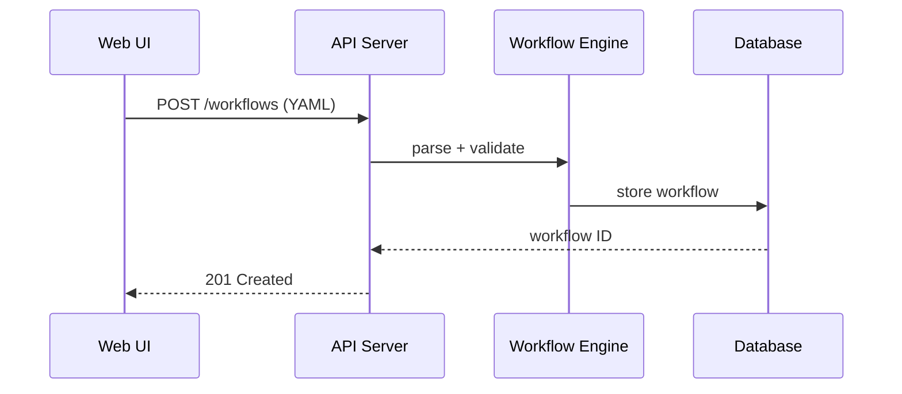
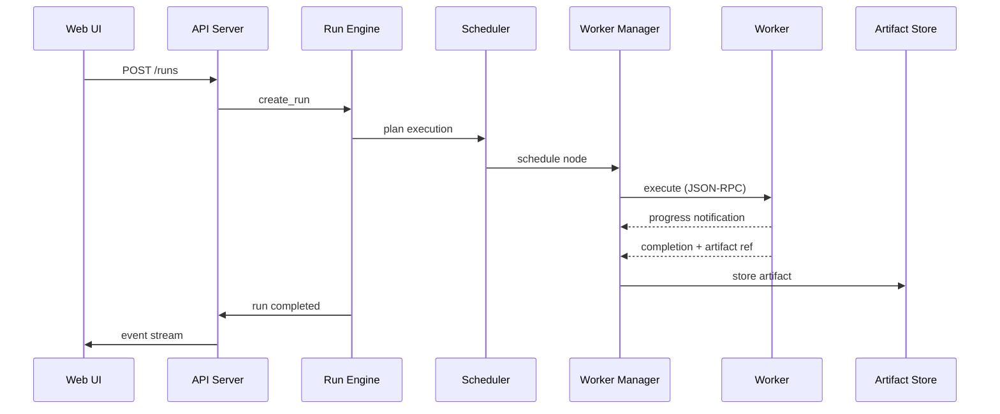

# 🏗️ Architecture

nexus-dnn is organized into four layers: a **React/TypeScript web UI** for visual editing and monitoring, a **Rust host runtime** that owns all execution authority, **extension workers** that run operator logic in isolated processes, and a **content-addressed artifact store** that persists all pipeline outputs.

---

## 🎯 Design Principles

- **Host is authoritative** — the Rust runtime owns scheduling, validation, and lifecycle; workers are untrusted executors.
- **Graph-native** — workflows are directed acyclic graphs with typed ports, not linear scripts.
- **Artifacts over objects** — every node output is a content-addressed blob with a manifest, not an in-memory object.
- **Schema-first contracts** — extension manifests, operator definitions, and workflows are validated against JSON Schemas before acceptance.
- **Strong boundaries** — crates communicate through narrow trait interfaces; no crate reaches into another's internals.

---

## 📊 System Overview

```text
+----------------------------------------------------------+
|  Web UI (React/TypeScript)                               |
|  stage view | graph editor | run trace | artifact browser|
+----------------------------+-----------------------------+
                             |
                             | HTTP / WebSocket
                             v
+----------------------------------------------------------+
|  Rust Host Runtime                                       |
|  workflow engine | scheduler | artifact store | events   |
|  extension registry | worker manager | run engine        |
+-------------------+---------------------+----------------+
                    |                     |
                    | JSON-RPC (stdio)    | Filesystem
                    v                     v
      +------------------------+   +---------------------+
      | Extension Workers      |   | Artifact Store      |
      | Python | Native | Svc  |   | blobs + manifests   |
      +------------------------+   +---------------------+
```

---

## 📦 Crate Map

| Crate | Purpose | Key Dependencies |
|-------|---------|------------------|
| `nexus-core` | Binary entrypoint, application composition, configuration | clap, dirs, all internal crates |
| `nexus-api` | HTTP/WebSocket API server | axum, tower-http, rust-embed |
| `nexus-workflow` | Canonical workflow DAG model, validation, mutations | serde-saphyr, jsonschema |
| `nexus-scheduler` | Execution planning and node-to-worker scheduling | nexus-workflow, nexus-worker |
| `nexus-worker` | Worker process supervision and lifecycle management | tokio (process, io-util) |
| `nexus-artifact` | Artifact blob storage, manifests, and lineage tracking | sha2, tokio (fs) |
| `nexus-extension` | Extension discovery, manifest validation, operator indexing | serde-saphyr, jsonschema, semver |
| `nexus-protocol` | Shared protocol types for host-worker communication | serde, semver |
| `nexus-events` | Typed event bus with broadcast and adapter support | tokio (sync), chrono |
| `nexus-storage` | Metadata database (SQLite) with migration support | sqlx (sqlite) |
| `nexus-run` | Run engine orchestrating full workflow execution | all internal crates |

---

## 🔄 Request Flow

### Workflow Editing



### Execution



---

## 📁 Data Directory Layout

```
~/.nexus/
├── db/
│   └── nexus.db            # SQLite metadata database
├── artifacts/
│   ├── blobs/              # Content-addressed artifact blobs
│   ├── manifests/          # Artifact manifest JSON files
│   ├── temp/               # In-progress uploads
│   └── cache/              # Derived artifact cache
├── extensions/             # Installed extension packages
└── logs/                   # Runtime log files
```

| Directory | Purpose |
|-----------|---------|
| `db/` | SQLite database storing workflows, runs, extension metadata |
| `artifacts/blobs/` | SHA-256 addressed binary blobs produced by nodes |
| `artifacts/manifests/` | JSON manifests linking blob hashes to run lineage |
| `artifacts/temp/` | Staging area for blobs being written by workers |
| `artifacts/cache/` | Derived or transformed artifacts for faster re-access |
| `extensions/` | Each subdirectory is one extension package with a `manifest.yaml` |
| `logs/` | Structured log output when file logging is enabled |

---

## 🎨 Frontend Surfaces (Spec 037)

### Generic ChatSurface

The host frontend ships a single `ChatSurface` shell at [`apps/web/src/components/chat/`](../apps/web/src/components/chat/) — a generic, extension-agnostic chat UI (thread rail, message bubbles, composer, model picker, sampler panel, code-block renderer) that is consumed by both the host-rendered Local LLM YAML layout and the dedicated chat route, and is reusable by any deployment-detail view that wants chat context. The component contract has zero references to specific extension ids; the YAML registry adapter (`apps/web/src/layout/component_registry.tsx`) maps the data shape onto props.

### Draft AI Suggestion Stream

The host exposes an extension-agnostic SSE handler family at [`crates/nexus-api/src/handlers/draft_suggestions/`](../crates/nexus-api/src/handlers/draft_suggestions/) under:

- `POST /api/v1/modules/drafts/{draft_id}/suggestions` — opens an SSE stream emitting `stream_started → token → partial → complete | error | cancelled`.
- `POST /api/v1/modules/drafts/{draft_id}/suggestions/{stream_id}/cancel` — idempotent cancel.

The handler implements policy "any lease that supports text completion with ≥ 2k context"; backend selection is driven by `nexus-backend-runtime-leases` and is independent of which extension publishes the runtime. Full request/response shapes and event variants are documented in [`docs/api/openapi.yaml`](api/openapi.yaml) and [`docs/api/API.md`](api/API.md). The frontend pill at `apps/web/src/components/draft/ai_suggestion_pill.tsx` consumes the stream via the SSE client at `apps/web/src/services/draft_suggestions.ts` and the React hook at `apps/web/src/components/draft/ai_suggestion_stream.ts`.

---

## 🖥️ Spec 042 — Neo-Terminal Desktop Shell

### Block primitive — the new UI atom

Spec 042 introduces the **Block** as the canonical UI atom for every actionable surface that hosts dense telemetry, transient operations, or live data streams. A Block is a prompt-style container that packages four concerns into one focusable element: a mono-numbered prompt header, a 4-letter mnemonic chip (registered with the host search palette so any Block is reachable by short-circuit), a collapsed-state inline sparkline that previews the underlying signal without expanding, and an inset-only phosphor focus glow that signals activation without reaching into outer-halo territory.

Source: [`apps/web/src/components/blocks/`](../apps/web/src/components/blocks/) (`block.tsx`, `block_header.tsx`, `block.css.ts`).

The Block's design constraints derive from the Bloomberg-dense / Kinetic Observatory aesthetic locked in [`docs/brainstorms/2026-05-08-terminal-on-steroids-lattice.md`](brainstorms/2026-05-08-terminal-on-steroids-lattice.md):

- **4 px base spacing**, JetBrains Mono throughout, `font-variant-numeric: tabular-nums` on every metric so digits never jitter.
- **Inset-only phosphor glow** — focus state lives inside the element via `box-shadow: inset`, never an outer halo.
- **Mnemonic-first navigation** — the 4-letter chip is the call-to-action contract for the host's `cmd_block_register_mnemonic` IPC command, defined in [`specs/042-neo-terminal-shell/contracts/ipc-commands.md`](../specs/042-neo-terminal-shell/contracts/ipc-commands.md). Duplicates resolve to a conflict response, never silently overwrite.
- **No hard-coded visual quantities** — every length, duration, opacity, and color reads from the [`terminal.*`](../apps/web/src/styles/tokens/terminal.css.ts) semantic-role token group, enforced by the [`scan-terminal-tokens.mjs`](../apps/web/scripts/scan-terminal-tokens.mjs) lint scan (`pnpm scan:terminal-tokens`).

The Block exists as a primitive precisely so screens like the model-load Lattice, the recipe runner, and the chat thread list can compose dense interactive surfaces without re-deriving the prompt-style header / focus glow / sparkline contract per surface. Spec 042 ships the primitive; subsequent consumers wire it into their views without further design work.

### RunEventItem event substrate

The same spec introduces a generic, versioned, sequence-numbered structured event protocol that decouples worker telemetry from UI rendering. Every nexus-dnn worker scraper (model loader, dependency installer, GGUF probe, future surfaces) emits a stream of `RunEventItem` records that the frontend's tiered store ingests and the UI surfaces project into the Lattice, the Pulse-Floor, the Block sparkline, and the inspector drawer.

Source: [`crates/nexus-run-events/`](../crates/nexus-run-events/) on the Rust side; [`apps/web/src/services/run_events.ts`](../apps/web/src/services/run_events.ts) (hot ring buffer + rAF-batched fan-out) and [`apps/web/src/services/run_events_warm.ts`](../apps/web/src/services/run_events_warm.ts) (IndexedDB warm tier) on the frontend side.

```text
worker stderr/stdout
        |
        v
  WorkerScraper trait  ── ingest_line / flush ──> Vec<RunEventItem>
        |
        v
  EventBatch transport ── seq, ts_ms, source, kind ──> hot ring buffer (~2k items per run)
        |                                              ──> warm tier (IndexedDB, capped ~50 MB)
        v
  rAF-batched fan-out ──> Lattice cells / Pulse-Floor traces / Block sparkline / inspector drawer
```

Key contract guarantees (full schema in [`specs/042-neo-terminal-shell/contracts/run-event.schema.json`](../specs/042-neo-terminal-shell/contracts/run-event.schema.json)):

- **Versioned**: `SCHEMA_V1 = "nexus.run-event.v1"`. Additive enum variants and additive optional fields ride the same version; breaking changes mint `v2`. Unknown variants deserialise via `#[non_exhaustive]` semantics, never panic.
- **Sequence-numbered**: monotonic `seq` per `(run_id, source)` pair so the frontend can detect gaps and emit `Gap` markers when the warm tier rolls a window.
- **Generic**: every variant is shape-driven, never extension-named. `Phase`, `Metric`, `TensorAllocate`, `Error`, `LineStream`, and `ScraperUnknown` are the cross-cutting kinds; no `kind: "local_llm_thing"` exists.
- **Tested**: schema-roundtrip contract test at [`crates/nexus-run-events/tests/schema_compat.rs`](../crates/nexus-run-events/tests/schema_compat.rs); boundary audit at [`crates/nexus-run-events/scripts/boundary_audit.ps1`](../crates/nexus-run-events/scripts/boundary_audit.ps1) gates every merge.

Adding a new worker scraper means implementing `WorkerScraper`, returning a stable `id()`, and translating raw lines into typed events in `ingest_line`. The frontend gains the new telemetry for free — every Block / Lattice / Pulse-Floor consumer subscribes by `RunId`, not by extension or scraper identity.

---

## 🔗 Related Documentation

| Document | Description |
|----------|-------------|
| [Getting Started](getting-started.md) | Build and run your first workflow |
| [Configuration](configuration.md) | Environment variables and CLI flags |
| [API Reference](api-reference.md) | HTTP and WebSocket endpoint specs |
| [Worker Protocol](worker-protocol.md) | JSON-RPC host-worker contract |
| [Data Model](data-model.md) | Logical schema reference for all entities |
| [Database Schema](database-schema.md) | SQLite tables, columns, and indexes |

---

> 🔗 [Back to Documentation Hub](README.md) | [Back to Project Root](../README.md)
