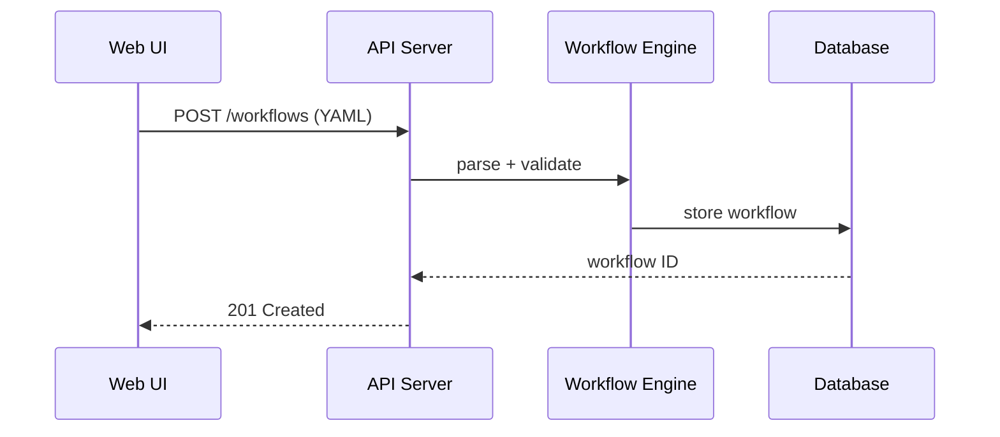
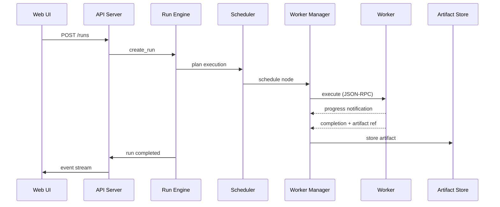

# 🏗️ Architecture

nexus-dnn is organized into four layers: a **React/TypeScript web UI** for visual editing and monitoring, a **Rust host runtime** that owns all execution authority, **extension workers** that run operator logic in isolated processes, and a **content-addressed artifact store** that persists all pipeline outputs.

---

## 🎯 Design Principles

- **Host is authoritative** — the Rust runtime owns scheduling, validation, and lifecycle; workers are untrusted executors.
- **Graph-native** — workflows are directed acyclic graphs with typed ports, not linear scripts.
- **Artifacts over objects** — every node output is a content-addressed blob with a manifest, not an in-memory object.
- **Schema-first contracts** — extension manifests, operator definitions, and workflows are validated against JSON Schemas before acceptance.
- **Strong boundaries** — crates communicate through narrow trait interfaces; no crate reaches into another's internals.

---

## 📊 System Overview

```text
+----------------------------------------------------------+
|  Web UI (React/TypeScript)                               |
|  stage view | graph editor | run trace | artifact browser|
+----------------------------+-----------------------------+
                             |
                             | HTTP / WebSocket
                             v
+----------------------------------------------------------+
|  Rust Host Runtime                                       |
|  workflow engine | scheduler | artifact store | events   |
|  extension registry | worker manager | run engine        |
+-------------------+---------------------+----------------+
                    |                     |
                    | JSON-RPC (stdio)    | Filesystem
                    v                     v
      +------------------------+   +---------------------+
      | Extension Workers      |   | Artifact Store      |
      | Python | Native | Svc  |   | blobs + manifests   |
      +------------------------+   +---------------------+
```

---

## 📦 Crate Map

| Crate | Purpose | Key Dependencies |
|-------|---------|------------------|
| `nexus-core` | Binary entrypoint, application composition, configuration | clap, dirs, all internal crates |
| `nexus-api` | HTTP/WebSocket API server | axum, tower-http, rust-embed |
| `nexus-workflow` | Canonical workflow DAG model, validation, mutations | serde-saphyr, jsonschema |
| `nexus-scheduler` | Execution planning and node-to-worker scheduling | nexus-workflow, nexus-worker |
| `nexus-worker` | Worker process supervision and lifecycle management | tokio (process, io-util) |
| `nexus-artifact` | Artifact blob storage, manifests, and lineage tracking | sha2, tokio (fs) |
| `nexus-extension` | Extension discovery, manifest validation, operator indexing | serde-saphyr, jsonschema, semver |
| `nexus-protocol` | Shared protocol types for host-worker communication | serde, semver |
| `nexus-events` | Typed event bus with broadcast and adapter support | tokio (sync), chrono |
| `nexus-storage` | Metadata database (SQLite) with migration support | sqlx (sqlite) |
| `nexus-run` | Run engine orchestrating full workflow execution | all internal crates |

---

## 🔄 Request Flow

### Workflow Editing



### Execution



---

## 📁 Data Directory Layout

```
~/.nexus/
├── db/
│   └── nexus.db            # SQLite metadata database
├── artifacts/
│   ├── blobs/              # Content-addressed artifact blobs
│   ├── manifests/          # Artifact manifest JSON files
│   ├── temp/               # In-progress uploads
│   └── cache/              # Derived artifact cache
├── extensions/             # Installed extension packages
└── logs/                   # Runtime log files
```

| Directory | Purpose |
|-----------|---------|
| `db/` | SQLite database storing workflows, runs, extension metadata |
| `artifacts/blobs/` | SHA-256 addressed binary blobs produced by nodes |
| `artifacts/manifests/` | JSON manifests linking blob hashes to run lineage |
| `artifacts/temp/` | Staging area for blobs being written by workers |
| `artifacts/cache/` | Derived or transformed artifacts for faster re-access |
| `extensions/` | Each subdirectory is one extension package with a `manifest.yaml` |
| `logs/` | Structured log output when file logging is enabled |

---

## 🔗 Related Documentation

| Document | Description |
|----------|-------------|
| [Getting Started](getting-started.md) | Build and run your first workflow |
| [Configuration](configuration.md) | Environment variables and CLI flags |
| [API Reference](api-reference.md) | HTTP and WebSocket endpoint specs |
| [Worker Protocol](worker-protocol.md) | JSON-RPC host-worker contract |
| [Data Model](data-model.md) | Logical schema reference for all entities |
| [Database Schema](database-schema.md) | SQLite tables, columns, and indexes |

---

> 🔗 [Back to Documentation Hub](README.md) | [Back to Project Root](../README.md)
