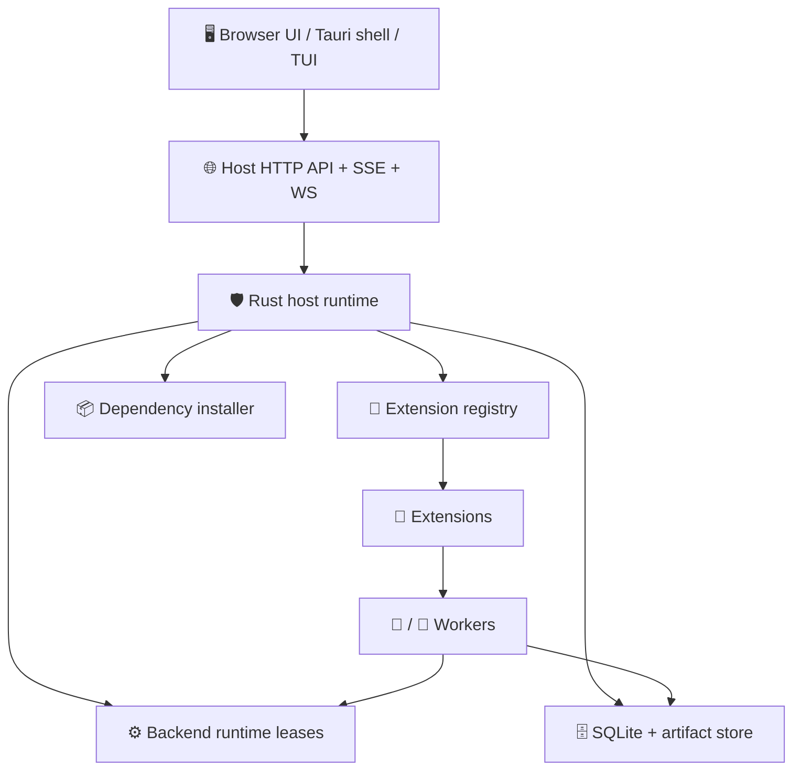
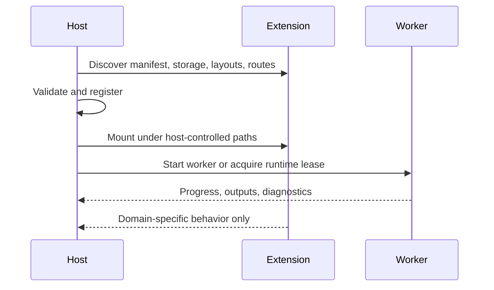
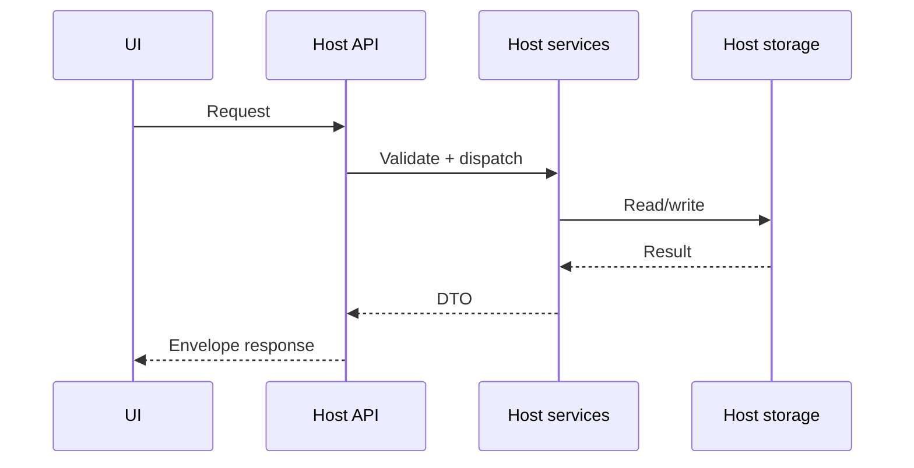
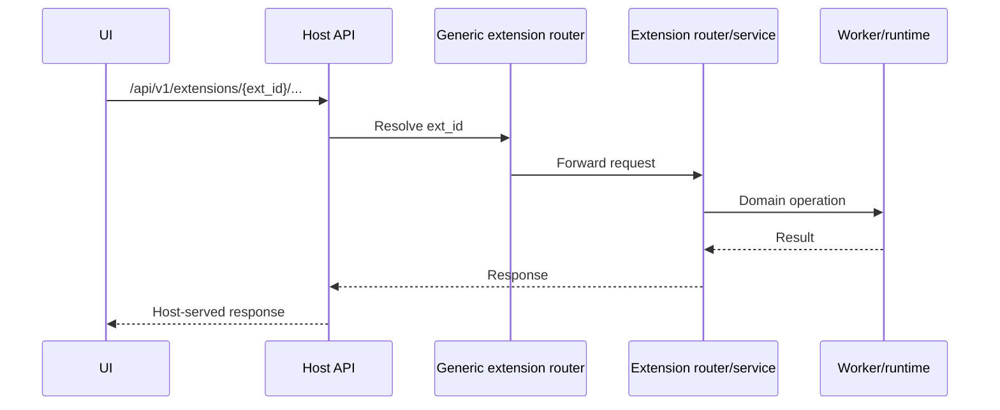

# 🏗️ Architecture

`nexus-dnn` is a host-authoritative local AI platform. Extensions can add capability, but they do not become the control plane.

## Core Rule

> The host owns lifecycle, routing, storage, installs, runtime leases, and cross-extension policy.

That rule matters more than any individual crate or API path.

## System View

## What The Host Owns

| Concern | Host responsibility |
|---------|---------------------|
| API | Routes, envelopes, health, frontend serving, extension mount points |
| Extension lifecycle | Discovery, validation, enable/disable, dependency install, storage namespace application |
| Execution | Run creation, workflow persistence, artifact lineage, event fanout |
| Runtime management | Backend install catalogs, lease issuance, runtime process policy |
| UX composition | Mounting extension layouts and assets into host-owned surfaces |

## What Extensions Own

| Concern | Extension responsibility |
|---------|--------------------------|
| Domain logic | Operators, recipes, worker behavior |
| Optional API surface | Router implementation mounted by the host |
| Optional UI surface | Layout YAML, assets, custom elements, contribution metadata |
| Optional storage namespace | Extension-local tables defined declaratively and applied by the host |
| Optional backend runtime manifests | Runtime families and worker entrypoints the host can manage |

## Authority Boundary

An extension can be powerful without being sovereign.

## Crate Map

These crates are the most important ones to understand first:

| Crate | Role |
|-------|------|
| `crates/nexus-core` | process startup, config loading, host composition |
| `crates/nexus-api` | HTTP router, SPA serving, extension dispatch, DTO envelopes |
| `crates/nexus-extension` | extension manifests, discovery, router-provider boundary |
| `crates/nexus-backend-runtimes` | runtime catalogs, installs, leases, backend orchestration |
| `crates/nexus-models-store` | host model catalog, downloads, install jobs |
| `crates/nexus-storage` | SQLite migrations and host persistence |
| `crates/nexus-run-events` | structured event stream substrate |
| `crates/nexus-desktop-shell` | desktop-shell control layer for the Tauri surface |

## Request Flow

### Host-owned path

### Extension-routed path

The host still owns the mount point, the HTTP server, and the extension registry even when the feature is extension-specific.

## Built-in Extension Reality

The current repo ships five first-party built-in extensions:

- `nexus.local-llm`
- `nexus.audio.emotiontts`
- `nexus.video.ltx23`
- `nexus.video.longcat`
- `nexus.video.svi2-pro`

Some ship only host-consumed layouts and contributions. Some also ship static web bundles and custom elements. Several declare backend runtimes. The host remains the common control layer for all of them.

## Storage Model

There are two storage tiers:

1. Host-owned storage
   Workflows, runs, artifacts, runtime install state, model-store state, and shared metadata.
2. Extension-owned namespaces
   Extension-specific tables, but only through host-applied storage declarations.

This is why extension data can be isolated without letting extensions mutate host persistence arbitrarily.

## Runtime Model

The runtime story is intentionally layered:

1. The host discovers runtime declarations.
2. The host resolves installation state and prerequisites.
3. The host starts or leases runtime processes.
4. Extensions consume those leases rather than silently launching unmanaged backends.

That design is already visible in the local-LLM and video stacks and is the foundation for future remote-worker work.

## Read Next

- [configuration.md](configuration.md)
- [extension-internals.md](extension-internals.md)
- [platform-support.md](platform-support.md)
- [roadmap.md](roadmap.md)
