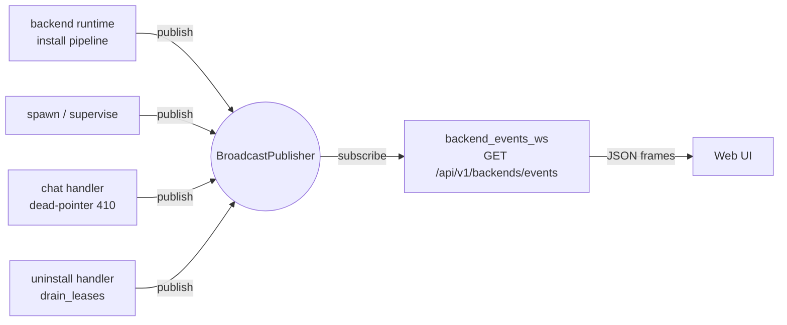
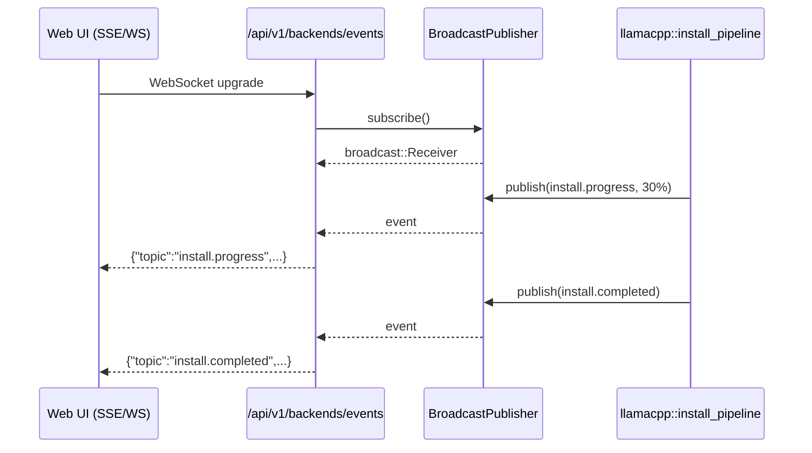
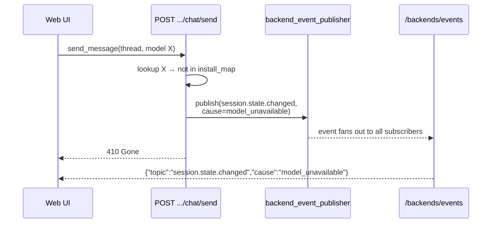

# 📡 Backend Events

The **backend event bus** is how the host tells the outside world what its backend runtimes (llama.cpp, tensorrt-llm, …) are doing — install progress, lease lifecycle, session state, process health. One in-process tokio broadcast channel; many emitters; one subscriber that fans events out over a WebSocket.

---

## 🎯 Who Speaks to Whom



- **Emitters** only hold an `EventPublisher` trait object. They don't know there's a channel underneath.
- **Subscriber** lives in exactly one place: the WebSocket handler. It holds the concrete `BroadcastPublisher` because subscription semantics are channel-specific.
- **UI** consumes the stream with a `type` filter in the query string and renders toasts, progress bars, log tails.

---

## 🧩 The Two Views on `AppState`

One broadcast channel, two typed handles:

```rust
pub struct AppState {
    // Emit surface — trait object. Stub with a mock in tests.
    pub backend_event_publisher: SharedPublisher,     // = Arc<dyn EventPublisher>

    // Subscribe surface — concrete. Keeps the broadcast::Receiver factory.
    pub backend_event_bus: Arc<BroadcastPublisher>,
    // ...
}
```

Why split?

| Concern | Handle used | Reason |
|---------|-------------|--------|
| Publishing events from a handler | `backend_event_publisher` | Trait-based — tests can inject a `MockEventPublisher` without wiring a real tokio channel. |

```mermaid
flowchart TB
    src[Arc::new&#40;BroadcastPublisher::new&#40;1024&#41;&#41;]
    src -->|clone, unsized to dyn| pub_field[AppState.backend_event_publisher<br/>SharedPublisher]
    src -->|clone, concrete| sub_field[AppState.backend_event_bus<br/>Arc&lt;BroadcastPublisher&gt;]
    pub_field --> emit[publish path]
    sub_field --> wssub[.subscribe&#40;&#41; path]
```

| Subscribing from the WS endpoint | `backend_event_bus` | `.subscribe()` returns `broadcast::Receiver<BackendEvent>`, which is channel-specific and doesn't belong on the trait. |

Both fields are clones of the same `Arc<BroadcastPublisher>`, so emit and subscribe share one channel — no risk of publishing into a dead-end.



---

## 📦 What's on the Wire

Every event is a `BackendEvent` struct serialized as JSON:

```json
{
  "event_id": "evt_01J...",
  "topic": "install.progress",
  "emitted_at": 1714080000000,
  "backend": "extension.local-llm.llama.cpp",
  "runtime_install_id": "inst_ulid",
  "install_task_id": "task_ulid",
  "payload": { "phase": "download", "bytes_downloaded": 123, "bytes_total": 456 }
}
```

Common topics in the tree today:

| Topic | Who emits | Meaning |
|-------|-----------|---------|
| `install.progress` | `llamacpp::install_pipeline` | Download/extract/verify progress |
| `install.completed` | `llamacpp::install_pipeline` | Runtime ready to lease |
| `install.failed` | `llamacpp::install_pipeline` | Phase failure with remediation |
| `install.repaired` | `llamacpp::mod` | Auto-repair resolved |
| `process.spawned` | `spawn::real` / `stub` | Lease acquired a running process |
| `process.withdrawn` | `spawn` / `uninstall::drain_leases` | Lease released / process exited |
| `process.crashed` | `spawn::supervise` | Supervisor detected unexpected exit |
| `session.state.changed` | `extensions_local_llm::chat` | E.g. `cause: model_unavailable` (410 dead pointer) |
| `log.line` | `log_pipeline` | Structured log fan-out |

Topics are free-form strings; consumers filter by prefix.

---

## 🔁 End-to-End Flow

### Install progress → UI



### Dead-pointer 410 → UI



---

## 🧪 Testing the Emit Path

Because `backend_event_publisher` is a trait object, a unit test can assert emission without touching a real channel:

```rust
struct RecordingPublisher(Mutex<Vec<BackendEvent>>);

#[async_trait]
impl EventPublisher for RecordingPublisher {
    async fn publish(&self, event: BackendEvent) {
        self.0.lock().unwrap().push(event);
    }
}

// In test setup:
let recorder = Arc::new(RecordingPublisher(Mutex::new(Vec::new())));
let state = AppState {
    backend_event_publisher: recorder.clone(),  // coerces to SharedPublisher
    backend_event_bus: Arc::new(BroadcastPublisher::new(1)), // unused here
    // ...
};
```

Integration tests that exercise the WebSocket must use a real `BroadcastPublisher` for both fields — see `tests/backend_events_ws.rs` for the pattern.

---

## 🧭 Where to Find Things

| Thing | File |
|-------|------|
| `BackendEvent`, `EventPublisher`, `BroadcastPublisher`, `SharedPublisher` | `crates/nexus-backend-runtimes/src/events.rs` |
| Two `AppState` fields | `crates/nexus-api/src/lib.rs` |
| Production wiring (one `Arc`, cloned twice) | `crates/nexus-core/src/app.rs` |
| WebSocket endpoint | `crates/nexus-api/src/handlers/backend_events_ws.rs` |
| Route `GET /api/v1/backends/events` | `crates/nexus-api/src/router.rs` |
| Shared test harness (`AppState` factory) | `crates/nexus-api/tests/common/mod.rs` |

---

## ✋ Boundaries

- **Don't** add `subscribe` to the `EventPublisher` trait. It would drag `tokio::sync::broadcast::Receiver` into the abstraction and every mock would have to manufacture a receiver it never uses.
- **Don't** publish directly to `backend_event_bus` from new code. New emitters take `&dyn EventPublisher` (or `&SharedPublisher`) and callers pass `state.backend_event_publisher`.
- **Do** rely on topic strings for routing. No typed enum dispatch at the WS boundary — topics are open-ended by design so new backends can emit without touching the host.
