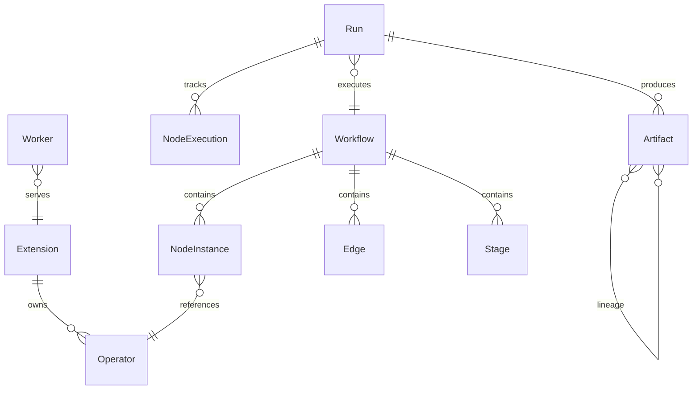
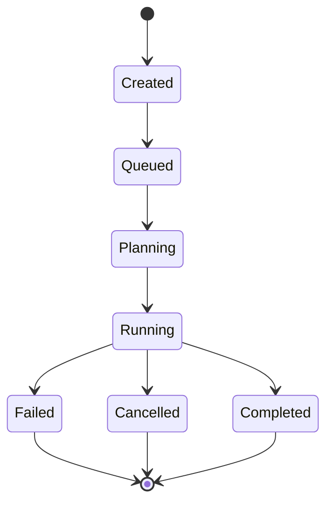
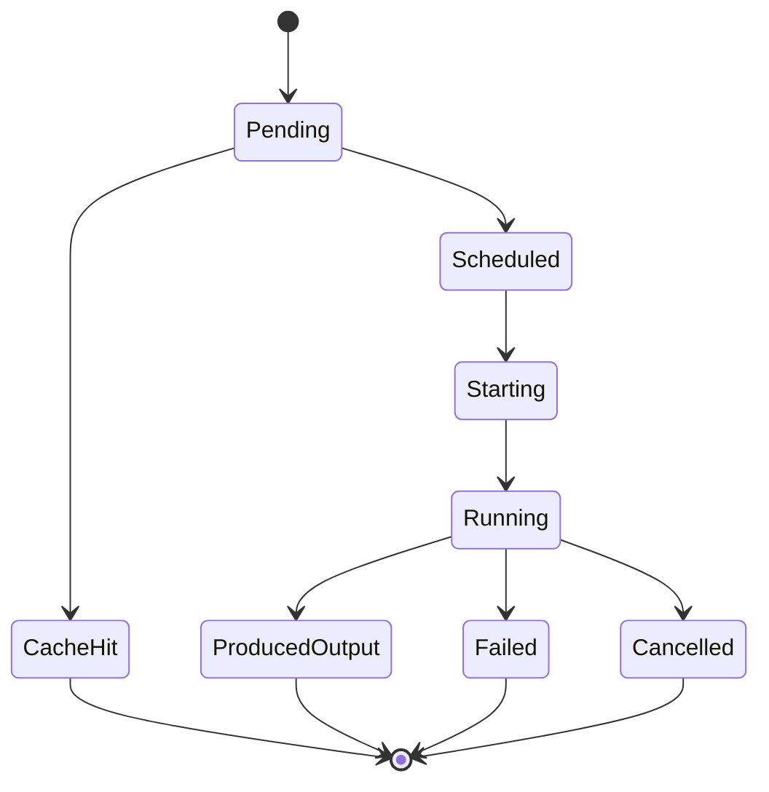
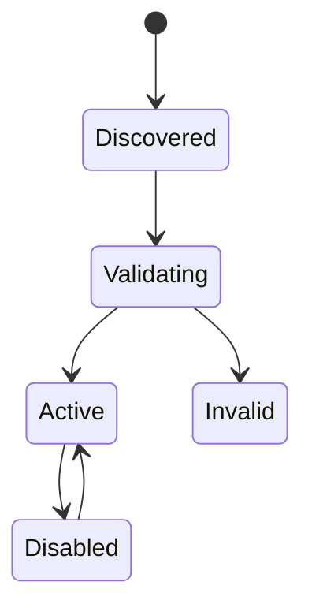

# 📊 Data Model

---

## 🏗️ Entity Relationships

---

## 📦 Entities

### Extension

| Field             | Type     | Description                                  |
|:------------------|:---------|:---------------------------------------------|
| `id`              | `String` | Reverse-DNS identifier (e.g. `ai.nexus.img`) |
| `name`            | `String?`| Human-readable display name                  |
| `version`         | `String` | Semver version of the extension              |
| `description`     | `String?`| Short description                            |
| `publisher`       | `String?`| Author or organization                       |
| `host_api_compat` | `String` | Semver range for host API compatibility      |
| `protocol_compat` | `String` | Semver range for worker protocol compat      |
| `runtime_family`  | `String` | Runtime type (`python`, `native`, ...)       |
| `entrypoint`      | `String` | Script or binary path relative to ext dir    |
| `capabilities`    | `String?`| JSON array of capability strings             |
| `status`          | `String` | Current lifecycle state                      |
| `directory`       | `String` | Filesystem path to extension root            |
| `installed_at`    | `String` | RFC 3339 timestamp                           |

### Operator

| Field            | Type     | Description                                |
|:-----------------|:---------|:-------------------------------------------|
| `id`             | `String` | Unique operator identifier                 |
| `version`        | `String` | Semver version                             |
| `extension_id`   | `String` | FK to owning extension                     |
| `display_name`   | `String?`| Human-readable name                        |
| `description`    | `String?`| What this operator does                    |
| `category`       | `String?`| Grouping category (e.g. `image`, `text`)   |
| `inputs`         | `String` | JSON array of port definitions             |
| `outputs`        | `String` | JSON array of port definitions             |
| `config_schema`  | `String?`| JSON Schema for operator configuration     |
| `execution_mode` | `String?`| `sync` or `streaming`                      |
| `cacheable`      | `i32?`   | `1` if outputs can be cached               |
| `resumable`      | `i32?`   | `1` if execution supports resume           |
| `resource_hints` | `String?`| JSON object with GPU, VRAM, CPU hints      |

### Workflow

| Field        | Type     | Description                              |
|:-------------|:---------|:-----------------------------------------|
| `id`         | `String` | Unique workflow identifier               |
| `title`      | `String` | Display title                            |
| `version`    | `String` | Semver version                           |
| `inputs`     | `String?`| JSON array of workflow-level input ports  |
| `outputs`    | `String?`| JSON array of output bindings            |
| `nodes`      | `String` | JSON array of node instances             |
| `edges`      | `String` | JSON array of data-flow edges            |
| `stages`     | `String?`| JSON array of execution stages           |
| `created_at` | `String` | RFC 3339 timestamp                       |
| `updated_at` | `String` | RFC 3339 timestamp                       |

### NodeInstance

| Field      | Type            | Description                              |
|:-----------|:----------------|:-----------------------------------------|
| `id`       | `String`        | Unique within the workflow               |
| `operator` | `String`        | Operator reference (`id@version`)        |
| `stage`    | `String?`       | Stage this node belongs to               |
| `inputs`   | `Map<String, NodeInput>` | Port bindings (reference or literal) |
| `config`   | `Value?`        | Operator-specific configuration          |

### Edge

| Field         | Type     | Description                     |
|:--------------|:---------|:--------------------------------|
| `source_node` | `String` | Upstream node ID                |
| `source_port` | `String` | Output port name on source node |
| `target_node` | `String` | Downstream node ID              |
| `target_port` | `String` | Input port name on target node  |

### Stage

| Field   | Type     | Description                  |
|:--------|:---------|:-----------------------------|
| `id`    | `String` | Stage identifier             |
| `label` | `String` | Human-readable stage name    |

### Run

| Field              | Type     | Description                      |
|:-------------------|:---------|:---------------------------------|
| `id`               | `String` | Unique run identifier            |
| `workflow_id`      | `String` | FK to the workflow being executed|
| `workflow_version` | `String` | Snapshot of workflow version     |
| `status`           | `String` | Current run status               |
| `started_at`       | `String?`| RFC 3339 timestamp               |
| `completed_at`     | `String?`| RFC 3339 timestamp               |
| `error`            | `String?`| Error message if failed          |
| `created_at`       | `String` | RFC 3339 timestamp               |

### NodeExecution

| Field          | Type     | Description                            |
|:---------------|:---------|:---------------------------------------|
| `run_id`       | `String` | FK to the parent run                   |
| `node_id`      | `String` | Which node in the workflow             |
| `status`       | `String` | Current node execution status          |
| `worker_id`    | `String?`| Worker that handled execution          |
| `started_at`   | `String?`| RFC 3339 timestamp                     |
| `completed_at` | `String?`| RFC 3339 timestamp                     |
| `duration_ms`  | `i64?`   | Wall-clock execution time              |
| `error`        | `String?`| Error message if failed                |

### Artifact

| Field          | Type     | Description                             |
|:---------------|:---------|:----------------------------------------|
| `id`           | `String` | Unique artifact identifier              |
| `artifact_type`| `String` | Data type (e.g. `tensor`, `json`)       |
| `run_id`       | `String` | FK to producing run                     |
| `node_id`      | `String` | FK to producing node                    |
| `port_name`    | `String` | Output port that produced this artifact |
| `content_hash` | `String` | SHA-256 content hash for deduplication  |
| `size_bytes`   | `i64`    | Size of the stored blob                 |
| `blob_path`    | `String` | Filesystem path to binary data          |
| `metadata`     | `String?`| JSON metadata (shape, dtype, etc.)      |
| `created_at`   | `String` | RFC 3339 timestamp                      |

### Worker

| Field          | Type             | Description                           |
|:---------------|:-----------------|:--------------------------------------|
| `worker_id`    | `String`         | Auto-generated worker identifier      |
| `extension_id` | `String`         | FK to the extension this worker serves|
| `status`       | `WorkerStatus`   | Current process status                |
| `operator_ids` | `Vec<String>`    | Operators this worker can execute     |

### Event

| Field  | Type     | Description                                      |
|:-------|:---------|:-------------------------------------------------|
| `type` | `String` | Event discriminator (e.g. `node_progress`)       |
| _..._  | varies   | Additional fields depend on event type           |

See [API Reference -- Event Stream](api-reference.md#-event-stream) for the full event type catalog.

---

## 🔄 State Machines

### Run Status

### Node Status

### Extension Status

---

## 📊 Enums

### RuntimeFamily

| Value              | Description                               |
|:-------------------|:------------------------------------------|
| `python`           | Python interpreter (spawns `python3`)     |
| `native`           | Precompiled binary (spawns the entrypoint)|
| `builtin`          | Host-embedded operator (no child process) |
| `external_service` | Remote service via HTTP/gRPC              |

### Capability

| Value                  | Description                          |
|:-----------------------|:-------------------------------------|
| `filesystem.read`      | Read files from the host filesystem  |
| `filesystem.write`     | Write files to the host filesystem   |
| `network.loopback`     | Localhost network access             |
| `network.remote`       | External network access              |
| `gpu.compute`          | GPU compute resources                |
| `process.spawn`        | Spawn child processes                |
| `model_registry.read`  | Read from the model registry         |
| `workspace.read`       | Read workspace files                 |
| `workspace.write`      | Write workspace files                |

### ExtensionStatus

| Value        | Description                              |
|:-------------|:-----------------------------------------|
| `discovered` | Found on disk, not yet validated         |
| `validating` | Manifest and schema validation in progress|
| `active`     | Validated and ready for use              |
| `invalid`    | Failed validation                        |
| `disabled`   | Manually disabled by user                |

### RunStatus

| Value       | Description                               |
|:------------|:------------------------------------------|
| `created`   | Run record exists, not yet queued         |
| `queued`    | Waiting for scheduler                     |
| `planning`  | Scheduler is building the execution plan  |
| `running`   | Nodes are actively executing              |
| `completed` | All nodes finished successfully           |
| `failed`    | One or more nodes failed                  |
| `cancelled` | Cancelled by user                         |

### NodeStatus

| Value            | Description                            |
|:-----------------|:---------------------------------------|
| `pending`        | Waiting for dependencies               |
| `cache_hit`      | Output found in cache, execution skipped|
| `scheduled`      | Assigned to a worker                   |
| `starting`       | Worker is initializing execution       |
| `running`        | Execution in progress                  |
| `produced_output`| Execution completed, output stored     |
| `failed`         | Execution failed                       |
| `cancelled`      | Cancelled before or during execution   |

### WorkerStatus

| Value       | Description                         |
|:------------|:------------------------------------|
| `starting`  | Process spawned, handshake pending  |
| `ready`     | Handshake complete, accepting work  |
| `busy`      | Currently executing an operator     |
| `unhealthy` | Health check failed                 |
| `stopped`   | Process terminated                  |

---

## 🔗 Related

- [Architecture](architecture.md)
- [API Reference](api-reference.md)
