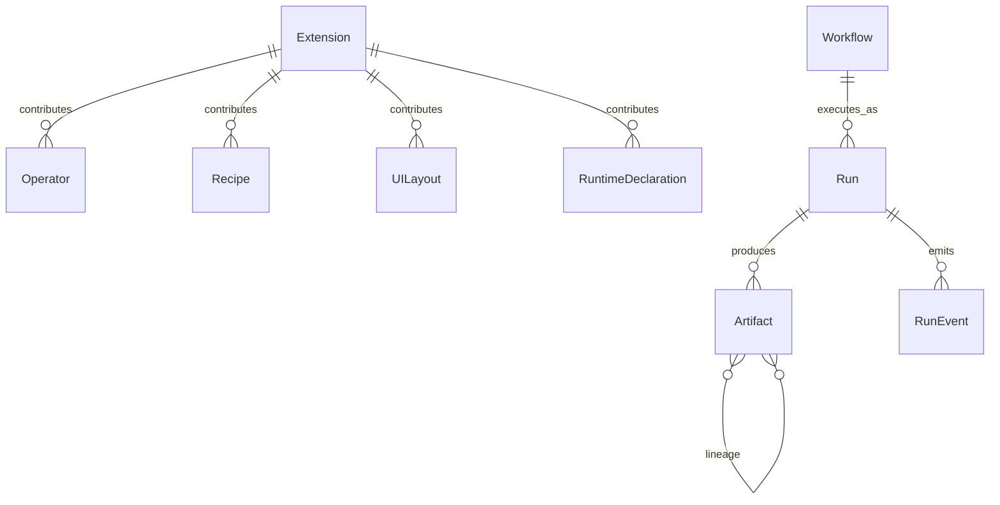
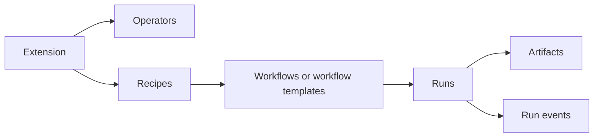

# 📊 Data Model

This is the current logical model of `nexus-dnn`. It is intentionally focused on ownership and relationships rather than pretending every evolving field list is stable forever.

## Mental Model

## Primary Host-Owned Entities

| Entity | Meaning |
|--------|---------|
| Extension | Installed capability package known to the host |
| Operator | Executable unit contributed by an extension |
| Recipe | Curated entrypoint/workflow template |
| Workflow | User- or system-authored graph stored by the host |
| Run | A single execution instance |
| Artifact | Output or intermediate produced during execution |
| Backend runtime | Host-managed runtime family/install/lease information |
| Model-store entry | Host-managed catalog/download/install metadata |

## Extension-Owned-But-Host-Governed Domains

| Domain | How it works |
|--------|--------------|
| Extension storage tables | declared by extension, applied by host in a namespace |
| Extension UI | declared by extension, mounted and served by host |
| Extension routes | implemented by extension, mounted by host |
| Extension workers | used by extension, lifecycle controlled by host |

## Ownership Rules

### Host authority

The host is the source of truth for:

- extension discovery state
- workflow persistence
- run lifecycle
- artifact bookkeeping
- backend runtime install and lease state
- host-wide API contracts

### Extension authority

An extension is the source of truth for:

- its own domain behavior
- its own manifest declarations
- its own storage schema within its namespace
- its own route semantics behind the host mount point

## Lifecycle Relationships

## State Notes

The exact enum sets continue to evolve, but these lifecycle buckets are stable enough to reason about:

| Area | Typical states |
|------|----------------|
| Extension lifecycle | discovered, validated, enabled, disabled, error |
| Dependency install | pending, running, succeeded, failed, cancelled |
| Run lifecycle | created, running, completed, failed, cancelled |
| Runtime install/lease | available, installing, leased, unhealthy, removed |

## Why This Doc Stays High-Level

The repo now contains substantial host and extension-specific growth, especially in model-store, runtime, and extension-owned storage areas. A “list every field forever” doc goes stale faster than the code.

For exact current wire or persistence details, use:

- [api-reference.md](api-reference.md)
- [api/API.md](api/API.md)
- [database-schema.md](database-schema.md)
- live migrations in `crates/nexus-storage/migrations/`
- extension migrations under `extensions/builtin/*/storage/migrations/`
