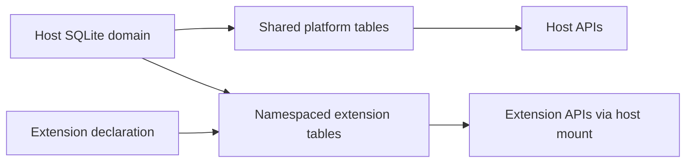

# 🗄️ Database Schema

This doc explains the current storage model without freezing the repo to stale column-by-column guesses.

## Storage Layers

There are two important SQLite categories in `nexus-dnn`:

1. **Host-owned storage**
   Shared platform data managed by host crates.
2. **Extension-owned namespaces**
   Extension-specific tables declared by extensions and applied by the host.

## Host-Owned Areas

The host database is where platform-wide state lives, including:

- workflows
- runs
- artifacts and lineage
- extension registry state
- backend runtime install and lease state
- model-store state and download jobs

The authoritative source for exact host schema is:

- `crates/nexus-storage/migrations/`

## Extension-Owned Areas

Several built-in extensions contribute their own storage namespaces today, for example:

- `local_llm`
- `emotion_tts`
- `nexus_video_ltx23`
- `svi2_pro`

Those tables are still host-governed in the sense that:

- the extension declares them
- the host applies them
- the host exposes lifecycle and verification APIs around them

## Why This Doc Is Not A Giant Column Dump

Earlier versions of the docs tried to enumerate every table and every field manually. That drifted badly as the platform gained:

- new host migrations
- extension-specific migrations
- backend runtime state
- model-store download jobs
- richer extension storage contributions

The accurate way to reason about schema now is by ownership and migration source.

## Source Of Truth Map

| Area | Source of truth |
|------|-----------------|
| Host schema | `crates/nexus-storage/migrations/` |
| Local LLM extension schema | `extensions/builtin/local-llm/storage/migrations/` |
| EmotionTTS schema | `extensions/builtin/emotion-tts/storage/migrations/` |
| LTX 2.3 schema | `extensions/builtin/nexus-video-ltx23/storage/migrations/` |
| SVI 2.0 Pro schema | `extensions/builtin/svi2-pro/storage/migrations/` |

## Practical Reading Guide

If you are trying to answer one of these questions:

- “Where are workflows stored?”
  Start with host migrations.
- “Who owns chat history for local LLM?”
  Start with the `local-llm` storage namespace.
- “Where does a video extension keep its extension-specific jobs or settings?”
  Start with that extension’s storage migrations.
- “Can extensions arbitrarily mutate host tables?”
  No. They contribute namespaced schema through host-controlled mechanisms.

## Relationship Sketch

## Related Docs

- [data-model.md](data-model.md)
- [extension-internals.md](extension-internals.md)
- [api-reference.md](api-reference.md)
