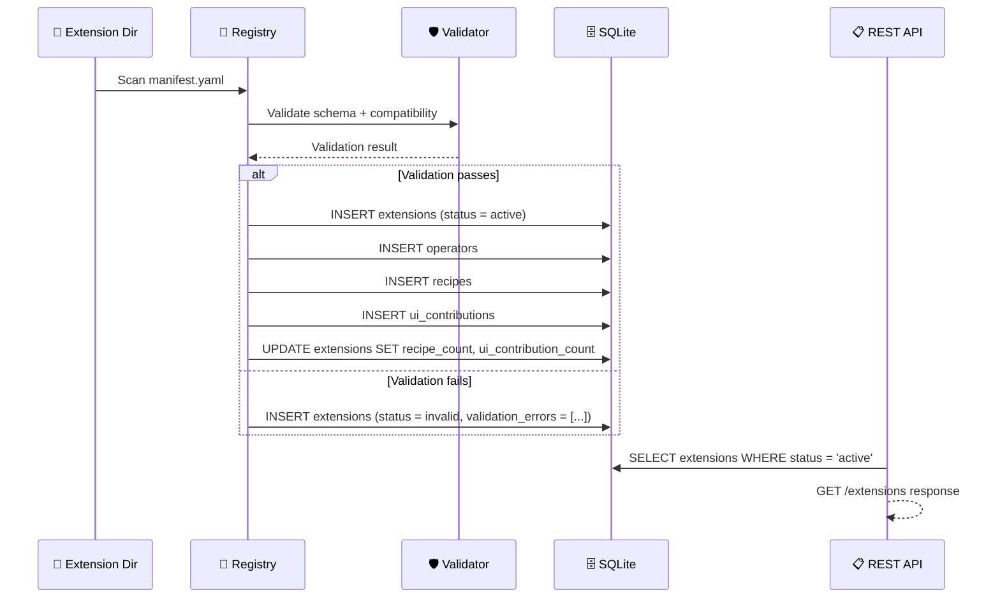
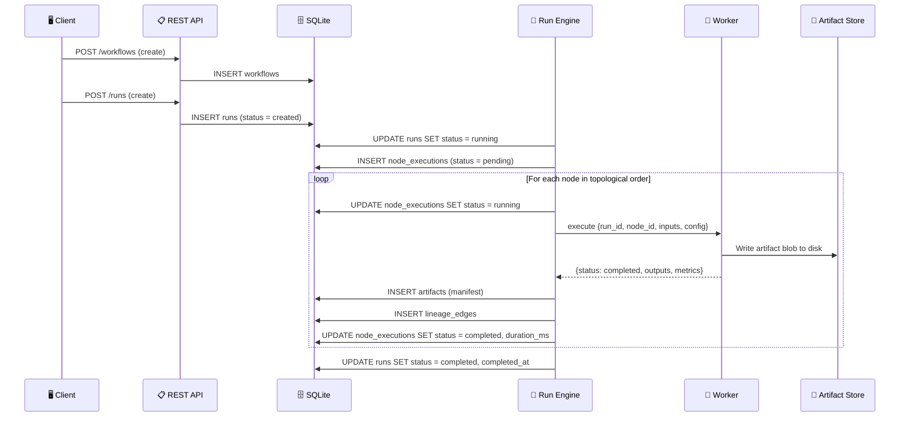
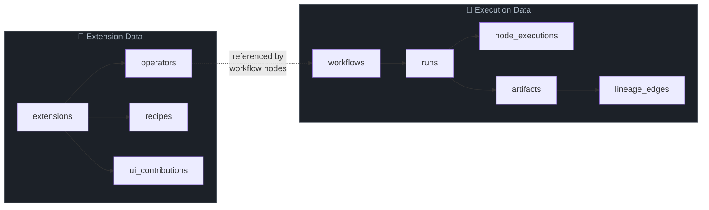

# 🗄️ Database Schema

Complete reference for the Nexus SQLite database — every table, column, index, and
relationship. The database stores extension metadata, workflow definitions, run tracking,
artifact manifests, and data lineage.

---

## 🏗️ Overview

| Property | Value |
|----------|-------|
| **Engine** | SQLite with WAL journal mode |
| **Location** | `~/.nexus/db/nexus.db` |
| **Migration tool** | sqlx (embedded migrations) |
| **Foreign keys** | Enforced (`PRAGMA foreign_keys = ON`) |
| **Migrations** | 2 migration files applied sequentially |

---

## 📊 Entity Relationship Diagram

```mermaid
erDiagram
    extensions ||--o{ operators : "owns"
    extensions ||--o{ recipes : "contributes"
    extensions ||--o{ ui_contributions : "contributes"
    workflows ||--o{ runs : "executed by"
    runs ||--o{ node_executions : "tracks"
    runs ||--o{ artifacts : "produces"
    artifacts ||--o{ lineage_edges : "is output_artifact"
    artifacts ||--o{ lineage_edges : "is input_artifact"

    extensions {
        TEXT id PK
        TEXT version
        TEXT status
    }
    operators {
        TEXT id PK
        TEXT version PK
        TEXT extension_id FK
    }
    recipes {
        TEXT id PK
        TEXT extension_id FK
    }
    ui_contributions {
        TEXT id PK
        TEXT extension_id FK
    }
    workflows {
        TEXT id PK
        TEXT version
    }
    runs {
        TEXT id PK
        TEXT workflow_id FK
        TEXT status
    }
    node_executions {
        TEXT run_id PK_FK
        TEXT node_id PK
        TEXT status
    }
    artifacts {
        TEXT id PK
        TEXT run_id FK
    }
    lineage_edges {
        TEXT output_artifact_id PK_FK
        TEXT input_artifact_id PK_FK
        TEXT run_id FK
    }
```

---

## 📦 Table: `extensions`

Stores metadata for every discovered extension package. One row per extension.

| Column | Type | Nullable | Default | Description |
|--------|------|:--------:|---------|-------------|
| `id` | TEXT | **PK** | -- | Unique dot-separated identifier (e.g., `example.image.basic`) |
| `name` | TEXT | ✅ | -- | Human-readable display name |
| `version` | TEXT | ❌ | -- | Semver version string |
| `description` | TEXT | ✅ | -- | Short description of extension capabilities |
| `publisher` | TEXT | ✅ | -- | Publisher identifier |
| `host_api_compat` | TEXT | ❌ | -- | Cargo-style semver range for host API compatibility |
| `protocol_compat` | TEXT | ❌ | -- | Cargo-style semver range for protocol compatibility |
| `runtime_family` | TEXT | ❌ | -- | Runtime type: `python`, `native`, `builtin`, `external_service` |
| `entrypoint` | TEXT | ❌ | -- | Relative path to worker entrypoint |
| `capabilities` | TEXT | ✅ | -- | JSON array of capability declarations |
| `status` | TEXT | ❌ | `'discovered'` | Extension state machine status |
| `directory` | TEXT | ❌ | -- | Absolute path to extension package directory |
| `installed_at` | TEXT | ❌ | -- | ISO 8601 timestamp of discovery |
| `recipe_count` | INTEGER | ✅ | `0` | Number of recipes contributed (computed on activation) |
| `ui_contribution_count` | INTEGER | ✅ | `0` | Number of UI contributions (computed on activation) |
| `validation_errors` | TEXT | ✅ | -- | JSON array of validation error strings; `NULL` when valid |

> 💡 **Tip:** The `status` column tracks the extension lifecycle state machine: `discovered` -> `validating` -> `valid` -> `active`, with `invalid`, `disabled`, and `quarantined` as additional states. See [Extension Internals](extension-internals.md) for the full state diagram.

---

## 📦 Table: `operators`

Stores operator contracts contributed by extensions. One row per operator version.

| Column | Type | Nullable | Default | Description |
|--------|------|:--------:|---------|-------------|
| `id` | TEXT | **PK** | -- | Operator identifier (unique within extension) |
| `version` | TEXT | **PK** | -- | Semver version string (composite PK with `id`) |
| `extension_id` | TEXT | ❌ | -- | FK -> `extensions.id` |
| `display_name` | TEXT | ✅ | -- | Human-readable name |
| `description` | TEXT | ✅ | -- | Short description |
| `category` | TEXT | ✅ | -- | Grouping category (e.g., `Image`, `Audio`) |
| `inputs` | TEXT | ❌ | -- | JSON array of typed input port definitions |
| `outputs` | TEXT | ❌ | -- | JSON array of typed output port definitions |
| `config_schema` | TEXT | ✅ | -- | JSON Schema for operator configuration |
| `execution_mode` | TEXT | ✅ | `'job'` | Execution mode: `job` or `streaming` (v0 supports `job` only) |
| `cacheable` | INTEGER | ✅ | `1` | Whether outputs can be cached (boolean as 0/1) |
| `resumable` | INTEGER | ✅ | `0` | Whether execution supports resume (boolean as 0/1) |
| `resource_hints` | TEXT | ✅ | -- | JSON object with scheduler hints (`gpu`, `cpu_cores`, `min_vram_mb`) |

**Primary Key:** (`id`, `version`)
**Foreign Key:** `extension_id` -> `extensions(id)`

> 💡 **Tip:** The `inputs` and `outputs` columns store serialized port definitions. Each port has `name`, `type`, `required`, and optionally `default`. Port types use the `category/subtype` format (e.g., `image/rgb`, `scalar/integer`).

---

## 📦 Table: `workflows`

Stores workflow definitions as DAG structures. Created via `POST /workflows` or
instantiated from recipe templates.

| Column | Type | Nullable | Default | Description |
|--------|------|:--------:|---------|-------------|
| `id` | TEXT | **PK** | -- | Unique workflow identifier |
| `title` | TEXT | ❌ | -- | Human-readable workflow title |
| `version` | TEXT | ❌ | -- | Semver version string |
| `inputs` | TEXT | ✅ | -- | JSON array of workflow-level input port definitions |
| `outputs` | TEXT | ✅ | -- | JSON array of workflow-level output port definitions |
| `nodes` | TEXT | ❌ | -- | JSON array of node instances (operator refs, config, input bindings) |
| `edges` | TEXT | ❌ | -- | JSON array of edges connecting node ports |
| `stages` | TEXT | ✅ | -- | JSON array of stage definitions for visual grouping |
| `created_at` | TEXT | ❌ | -- | ISO 8601 creation timestamp |
| `updated_at` | TEXT | ❌ | -- | ISO 8601 last-updated timestamp |

> 💡 **Tip:** The `nodes` column contains the full DAG structure. Each node references an operator via `operator: "id@version"` format and declares input bindings (e.g., `from: "input:source_image"` or `from: "resize_1:image_out"`).

---

## 📦 Table: `runs`

Tracks individual workflow executions. Each run is an immutable record of a workflow
execution at a specific version.

| Column | Type | Nullable | Default | Description |
|--------|------|:--------:|---------|-------------|
| `id` | TEXT | **PK** | -- | Unique run identifier |
| `workflow_id` | TEXT | ❌ | -- | FK -> `workflows.id` |
| `workflow_version` | TEXT | ❌ | -- | Snapshot of workflow version at run creation |
| `status` | TEXT | ❌ | `'created'` | Run status: `created`, `running`, `completed`, `failed`, `cancelled` |
| `started_at` | TEXT | ✅ | -- | ISO 8601 timestamp when run began executing |
| `completed_at` | TEXT | ✅ | -- | ISO 8601 timestamp when run finished |
| `error` | TEXT | ✅ | -- | Error message if run failed |
| `created_at` | TEXT | ❌ | -- | ISO 8601 creation timestamp |
| `run_label` | TEXT | ✅ | -- | User-assigned or system-generated label for display |
| `execution_profile` | TEXT | ✅ | -- | Execution profile hint: `fast`, `quality`, `debug` (advisory) |
| `predecessor_run_id` | TEXT | ✅ | -- | ID of a previous run this one continues or retries |

**Foreign Key:** `workflow_id` -> `workflows(id)`

> 💡 **Tip:** The `status` column follows a linear progression for successful runs: `created` -> `running` -> `completed`. Failure transitions to `failed`, and user cancellation transitions to `cancelled`.

---

## 📦 Table: `node_executions`

Tracks per-node execution state within a run. One row per node per run.

| Column | Type | Nullable | Default | Description |
|--------|------|:--------:|---------|-------------|
| `run_id` | TEXT | **PK** | -- | FK -> `runs.id` |
| `node_id` | TEXT | **PK** | -- | Node identifier within the workflow |
| `status` | TEXT | ❌ | `'pending'` | Node status: `pending`, `running`, `completed`, `failed`, `skipped` |
| `worker_id` | TEXT | ✅ | -- | Identifier of the worker process handling execution |
| `started_at` | TEXT | ✅ | -- | ISO 8601 timestamp when node began executing |
| `completed_at` | TEXT | ✅ | -- | ISO 8601 timestamp when node finished |
| `duration_ms` | INTEGER | ✅ | -- | Execution duration in milliseconds |
| `error` | TEXT | ✅ | -- | Error message if node execution failed |

**Primary Key:** (`run_id`, `node_id`)
**Foreign Key:** `run_id` -> `runs(id)`

> 💡 **Tip:** Node executions are created with `pending` status when a run starts. The engine updates them to `running` when the operator is dispatched to a worker, then to `completed` or `failed` on result.

---

## 📦 Table: `artifacts`

Stores artifact manifests (metadata). The actual blob data lives on the filesystem at
`blob_path`; this table holds the manifest only.

| Column | Type | Nullable | Default | Description |
|--------|------|:--------:|---------|-------------|
| `id` | TEXT | **PK** | -- | Unique artifact identifier |
| `artifact_type` | TEXT | ❌ | -- | Type identifier (e.g., `image/rgb`, `text/plain`) |
| `run_id` | TEXT | ❌ | -- | FK -> `runs.id` |
| `node_id` | TEXT | ❌ | -- | Node that produced this artifact |
| `port_name` | TEXT | ❌ | -- | Output port name on the producing node |
| `content_hash` | TEXT | ❌ | -- | SHA-256 hash of artifact content for deduplication |
| `size_bytes` | INTEGER | ❌ | -- | Size of artifact blob in bytes |
| `blob_path` | TEXT | ❌ | -- | Filesystem path to the artifact blob |
| `metadata` | TEXT | ✅ | -- | JSON object with additional artifact metadata |
| `created_at` | TEXT | ❌ | -- | ISO 8601 creation timestamp |

**Foreign Key:** `run_id` -> `runs(id)`

> 💡 **Tip:** Artifacts use a content-addressed storage model. The `content_hash` enables deduplication — if two operators produce identical output, only one blob is stored. The `blob_path` points to `~/.nexus/artifacts/<hash>`.

---

## 📦 Table: `lineage_edges`

Records the data lineage graph — which artifacts were consumed to produce other artifacts.
Enables full traceability from any output back to its source inputs.

| Column | Type | Nullable | Default | Description |
|--------|------|:--------:|---------|-------------|
| `output_artifact_id` | TEXT | **PK** | -- | FK -> `artifacts.id` — the produced artifact |
| `input_artifact_id` | TEXT | **PK** | -- | FK -> `artifacts.id` — the consumed artifact |
| `run_id` | TEXT | ❌ | -- | FK -> `runs.id` — the run in which this edge was created |
| `node_id` | TEXT | ❌ | -- | Node that consumed the input and produced the output |

**Primary Key:** (`output_artifact_id`, `input_artifact_id`)
**Foreign Keys:**
- `output_artifact_id` -> `artifacts(id)`
- `input_artifact_id` -> `artifacts(id)`
- `run_id` -> `runs(id)`

> 💡 **Tip:** Lineage edges form a directed acyclic graph (DAG). To trace the full provenance of an artifact, recursively follow `input_artifact_id` edges backward. To find all downstream derivatives, follow `output_artifact_id` edges forward.

---

## 📦 Table: `recipes`

Stores curated workflow entry points contributed by extensions. Each recipe maps
user-facing fields to a workflow template.

| Column | Type | Nullable | Default | Description |
|--------|------|:--------:|---------|-------------|
| `id` | TEXT | **PK** | -- | Globally unique recipe identifier (e.g., `recipe.image.basic_transform`) |
| `version` | TEXT | ❌ | -- | Semver version string |
| `display_name` | TEXT | ❌ | -- | Human-readable name shown in UI catalogs |
| `summary` | TEXT | ❌ | -- | One-line description |
| `category` | TEXT | ❌ | -- | Grouping category (e.g., `Image`, `Video`, `Audio`) |
| `extension_id` | TEXT | ❌ | -- | FK -> `extensions.id` |
| `extension_version` | TEXT | ❌ | -- | Extension version at registration time |
| `workflow_template_ref` | TEXT | ❌ | -- | Relative path to workflow YAML within extension package |
| `thumbnail` | TEXT | ✅ | -- | Relative path to thumbnail image |
| `input_summary` | TEXT | ✅ | -- | Brief description of expected inputs |
| `bindings` | TEXT | ❌ | -- | JSON array of field-to-workflow mappings |
| `created_at` | TEXT | ❌ | -- | ISO 8601 registration timestamp |

**Foreign Key:** `extension_id` -> `extensions(id)`

> 💡 **Tip:** The `bindings` column stores serialized `RecipeFieldBinding` entries. Each binding maps a `field` name to a `maps_to` target using prefixes: `input:<port_name>` for workflow inputs or `node:<node_id>.config.<key>` for node config values.

---

## 📦 Table: `ui_contributions`

Stores UI contribution metadata declared by extensions. The host reads these records to
render appropriate built-in components.

| Column | Type | Nullable | Default | Description |
|--------|------|:--------:|---------|-------------|
| `id` | TEXT | **PK** | -- | Unique contribution identifier |
| `kind` | TEXT | ❌ | -- | Contribution kind: `artifact_viewer`, `command`, `config_widget`, `inspector_panel`, `recipe_card`, `tool_metadata` |
| `extension_id` | TEXT | ❌ | -- | FK -> `extensions.id` |
| `display_name` | TEXT | ❌ | -- | Human-readable name |
| `description` | TEXT | ✅ | -- | Short description |
| `target` | TEXT | ✅ | -- | Target operator or artifact type this contribution applies to |
| `supported_types` | TEXT | ✅ | -- | JSON array of artifact types (primarily for `artifact_viewer`) |
| `priority` | INTEGER | ✅ | `0` | Priority for selection when multiple contributions match (higher wins) |
| `metadata` | TEXT | ✅ | -- | JSON object with kind-specific structured metadata |
| `availability` | TEXT | ❌ | `'available'` | Status: `available` or `unavailable` |

**Foreign Key:** `extension_id` -> `extensions(id)`

> 💡 **Tip:** UI contributions are metadata-only — no frontend bundles are stored. The `metadata` column carries kind-specific fields (e.g., `fallback` and `render_mode` for viewers, `target_operator` and `target_field` for config widgets).

---

## 🔗 Index Reference

All indexes defined across both migrations:

| Index | Table | Column(s) | Purpose |
|-------|-------|-----------|---------|
| `idx_runs_workflow_id` | `runs` | `workflow_id` | Fast lookup of runs by workflow |
| `idx_runs_status` | `runs` | `status` | Filter runs by execution status |
| `idx_node_executions_run_id` | `node_executions` | `run_id` | Retrieve all node states for a run |
| `idx_artifacts_run_id` | `artifacts` | `run_id` | Retrieve all artifacts produced by a run |
| `idx_lineage_edges_run_id` | `lineage_edges` | `run_id` | Retrieve lineage edges for a run |
| `idx_recipes_extension` | `recipes` | `extension_id` | List recipes by contributing extension |
| `idx_recipes_category` | `recipes` | `category` | Filter recipes by category |
| `idx_ui_contributions_kind` | `ui_contributions` | `kind` | Filter contributions by kind |
| `idx_ui_contributions_extension` | `ui_contributions` | `extension_id` | List contributions by extension |

---

## 🔄 Migration History

| Migration | File | Description |
|-----------|------|-------------|
| 001 | `001_initial.sql` | Core tables: `extensions`, `operators`, `workflows`, `runs`, `node_executions`, `artifacts`, `lineage_edges`. Enables WAL mode and foreign keys. |
| 002 | `002_recipes_contributions.sql` | Adds `recipes` and `ui_contributions` tables. Extends `extensions` with `recipe_count`, `ui_contribution_count`, `validation_errors`. Extends `runs` with `run_label`, `execution_profile`, `predecessor_run_id`. |

---

## 📡 Data Flow

### Extension Registration

How data flows into the database when the host discovers and activates an extension:



### Workflow Execution

How data flows during a workflow run:



### Key Relationships Across Tables



---

## 🔗 Related Documentation

| Document | Description |
|----------|-------------|
| [📊 Data Model](data-model.md) | Entity definitions, enums, and validation rules |
| [🏗️ Architecture](architecture.md) | System architecture and component overview |
| [🔧 Configuration](configuration.md) | Runtime configuration and directory layout |
| [🔌 Extension Internals](extension-internals.md) | Extension lifecycle and state machine |
| [📋 API Reference](api-reference.md) | REST endpoints that read/write these tables |
