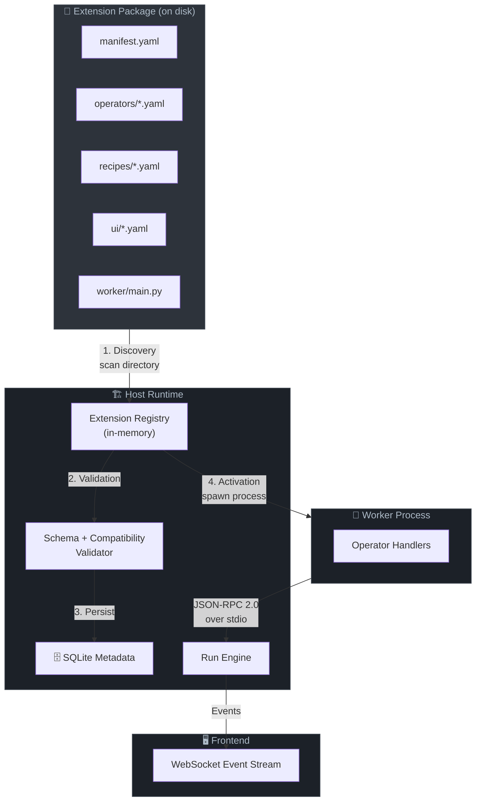
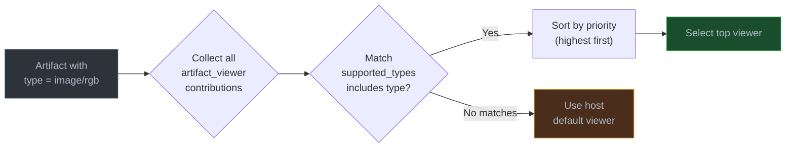

# 🔌 How Extensions Work

A deep dive into the extension system internals — architecture, lifecycle, communication
protocol, and integration points. For a hands-on tutorial on building extensions, see the
[Extension Development Guide](extension-guide.md).

---

## 🏗️ Extension Architecture Overview

Extensions are self-contained packages that contribute operators, recipes, and UI metadata
to the Nexus host. The host is **authoritative** — extensions extend its capabilities but
never own core semantics.



**Flow summary:**

| Step | Action | Result |
|------|--------|--------|
| 1 | Host scans `~/.nexus/extensions/` | Extension package discovered |
| 2 | Manifest parsed, JSON Schema validated, compatibility checked | Extension enters `valid` or `invalid` state |
| 3 | Operators, recipes, UI contributions persisted to SQLite | Metadata available via REST API |
| 4 | Worker process spawned, handshake completed | Extension enters `active` state |
| 5 | Execute requests sent during workflow runs | Results flow back through engine to frontend |

---

## 📁 Extension Package Anatomy

```
my-extension/
├── manifest.yaml              <- Package identity, compatibility, runtime config
├── operators/
│   ├── resize.yaml            <- Operator contract (ports, config schema)
│   └── grayscale.yaml         <- One file per operator
├── recipes/
│   └── basic_transform.yaml   <- Curated workflow entry point
├── ui/
│   ├── image_viewer.yaml      <- Artifact viewer contribution
│   └── run_command.yaml       <- Command contribution
├── worker/
│   ├── main.py                <- Runtime entrypoint (spawned by host)
│   └── requirements.txt       <- Python dependencies
└── workflows/
    └── basic_transform.yaml   <- Workflow template referenced by recipes
```

| File | Purpose | Required |
|------|---------|----------|
| `manifest.yaml` | Declares extension identity, compatibility ranges, runtime family, entrypoint, and references to all operator/recipe files | ✅ Yes |
| `operators/*.yaml` | Each file defines one operator: typed input/output ports, config JSON Schema, execution hints | ✅ At least one recommended |
| `recipes/*.yaml` | Each file defines one recipe: maps user-facing fields to workflow inputs and node config values | ❌ Optional |
| `ui/*.yaml` | UI contribution metadata (viewers, commands, widgets, panels, cards, tool metadata) | ❌ Optional |
| `worker/main.py` | Entrypoint the host spawns as a child process; implements JSON-RPC handlers | ✅ Yes |
| `worker/requirements.txt` | Python pip dependencies installed before worker launch | ❌ Optional |
| `workflows/*.yaml` | Workflow templates that recipes reference; same schema as `POST /workflows` payloads | ❌ Required if recipes are declared |

> 💡 **Tip:** The manifest's `operators` and `recipes` arrays use file references (`file: "operators/resize.yaml"`). All paths are relative to the extension package root.

---

## 🛡️ Extension Requirements Checklist

Every extension must satisfy these requirements to reach `active` status.

### Manifest Validation

| # | Requirement | Required | Validated By |
|---|-------------|----------|-------------|
| 1 | `manifest.yaml` present at package root | ✅ Yes | File existence |
| 2 | `spec_version` is `"0.1"` | ✅ Yes | JSON Schema |
| 3 | `extension.id` is unique, dot-separated (e.g., `example.image.basic`) | ✅ Yes | Schema + registry uniqueness |
| 4 | `extension.version` is valid semver | ✅ Yes | Schema |
| 5 | `compatibility.host_api` range includes current host version | ✅ Yes | Semver range check |
| 6 | `compatibility.protocol` range includes current protocol version | ✅ Yes | Semver range check |
| 7 | `runtime.family` is one of `python`, `native`, `builtin`, `external_service` | ✅ Yes | Enum check |
| 8 | `runtime.entrypoint` points to an existing file | ✅ Yes | File existence |
| 9 | No duplicate operator IDs within the extension | ✅ Yes | Schema + dedup check |
| 10 | No unknown capability declarations | ✅ Yes | Allowlist check |

### Operator Validation

| # | Requirement | Required | Validated By |
|---|-------------|----------|-------------|
| 11 | Each operator has a unique `id` and valid semver `version` | ✅ Yes | JSON Schema |
| 12 | Each operator declares at least one typed input | ✅ Yes | Schema |
| 13 | Each operator declares at least one typed output | ✅ Yes | Schema |
| 14 | `config_schema` is valid JSON Schema (if present) | ✅ Yes | `jsonschema` crate |
| 15 | Referenced operator YAML files exist on disk | ✅ Yes | File existence |

### Recipe Validation

| # | Requirement | Required | Validated By |
|---|-------------|----------|-------------|
| 16 | `recipe.id` is globally unique across all active extensions | ✅ Yes | Registry uniqueness |
| 17 | `recipe.version` is valid semver | ✅ Yes | Schema |
| 18 | `workflow_template` path resolves to existing file | ✅ Yes | File existence |
| 19 | `bindings.fields[].maps_to` uses recognized prefix (`input:` or `node:`) | ✅ Yes | Prefix check |
| 20 | Referenced workflow template passes structural validation (DAG, ports) | ✅ Yes | Workflow validator |

### UI Contribution Validation

| # | Requirement | Required | Validated By |
|---|-------------|----------|-------------|
| 21 | `kind` is one of the six recognized values | ✅ Yes | Enum check |
| 22 | `id` is unique within the extension | ✅ Yes | Dedup check |
| 23 | `display_name` is present | ✅ Yes | Schema |
| 24 | `artifact_viewer` declares at least one `supported_type` | ✅ Yes | Kind-specific check |
| 25 | `config_widget` declares `target_operator` and `target_field` | ✅ Yes | Kind-specific check |
| 26 | `recipe_card` declares `recipe_id` | ✅ Yes | Kind-specific check |
| 27 | `tool_metadata` declares `target_id` and `target_kind` | ✅ Yes | Kind-specific check |

### Worker Protocol Validation

| # | Requirement | Required | Validated By |
|---|-------------|----------|-------------|
| 28 | Worker completes `handshake` within timeout | ✅ Yes | Runtime |
| 29 | Worker responds to `list_operators` | ✅ Yes | Runtime |
| 30 | Worker implements `execute` for all registered operators | ✅ Yes | Runtime |
| 31 | Worker responds to `health` checks | ✅ Yes | Runtime (periodic) |

---

## 🔄 Extension Lifecycle

Extensions progress through a state machine managed by the host. Each state determines
what the extension can and cannot do.

```mermaid
stateDiagram-v2
    [*] --> Discovered : Host scans directory

    Discovered --> Validating : Schema + compatibility check

    Validating --> Valid : All checks pass
    Validating --> Invalid : Validation fails

    Valid --> Active : Operators indexed, worker started

    Active --> Disabled : User disables
    Active --> Quarantined : Repeated failures

    Disabled --> Active : User re-enables
    Disabled --> Validating : Re-enable with re-validation

    Quarantined --> Validating : Re-scan triggered

    Invalid --> Validating : Manifest updated + re-scan
```



### State Reference

| State | Description | Operators Available | Worker Running | Runs Allowed | Historical Data |
|-------|-------------|:-------------------:|:--------------:|:------------:|:---------------:|
| `discovered` | Package found on disk, not yet validated | ❌ | ❌ | ❌ | -- |
| `validating` | Validation in progress (schema, compatibility, file checks) | ❌ | ❌ | ❌ | -- |
| `valid` | Passed validation, not yet activated (transient) | ❌ | ❌ | ❌ | -- |
| `invalid` | Failed validation; `validation_errors` populated | ❌ | ❌ | ❌ | -- |
| `active` | Validated, operators indexed, worker serving requests | ✅ | ✅ | ✅ | ✅ |
| `disabled` | Manually disabled by user | ❌ | ❌ | ❌ | ✅ Preserved |
| `quarantined` | Isolated due to repeated worker crashes or protocol violations | ❌ | ❌ | ❌ | ✅ Preserved |

> ⚠️ **Warning:** When an extension enters `quarantined`, its operators are removed from the registry and no new runs can reference them. Existing run history and artifacts are preserved.

### Transition Triggers

| From | To | Trigger |
|------|----|---------|
| -- | `discovered` | Host scans extensions directory at startup or on rescan |
| `discovered` | `validating` | Automatic after discovery |
| `validating` | `valid` | All schema, compatibility, and file checks pass |
| `validating` | `invalid` | Any validation check fails |
| `valid` | `active` | Operators persisted, worker spawned and handshake completed |
| `active` | `disabled` | User sends `POST /extensions/:id/disable` |
| `active` | `quarantined` | Worker crashes exceed threshold or protocol violations detected |
| `disabled` | `active` | User sends `POST /extensions/:id/enable` |
| `disabled` | `validating` | User triggers re-enable with re-validation |
| `quarantined` | `validating` | Re-scan triggered via API |
| `invalid` | `validating` | Manifest updated on disk + re-scan triggered |

---

## 📡 Host <-> Worker Communication

Workers are child processes spawned by the host. Communication uses **JSON-RPC 2.0 over
stdio** with newline-delimited JSON messages.

### Protocol Sequence

```mermaid
sequenceDiagram
    participant H as 🏗️ Host
    participant W as 🐍 Worker Process

    H ->> W : spawn(entrypoint) with piped stdio

    Note over H, W : Phase 1 — Handshake (must be first message)
    H ->> W : handshake {protocol_version, host_version}
    W -->> H : {protocol_version, worker_name, extension_id}

    Note over H, W : Phase 2 — Capability Discovery
    H ->> W : list_operators {}
    W -->> H : {operators: [{id, version}, ...]}

    Note over H, W : Phase 3 — Steady State
    rect rgb(30, 40, 55)
        loop Health Checks (periodic)
            H ->> W : health {}
            W -->> H : {status: "healthy"}
        end
    end

    rect rgb(25, 45, 35)
        Note over H, W : Phase 4 — Execution
        H ->> W : execute {run_id, node_id, operator, inputs, config, output_targets}
        W --) H : progress {percent: 25, message: "Loading..."}
        W --) H : log {level: "info", message: "Model loaded"}
        W --) H : progress {percent: 75, message: "Processing..."}
        W -->> H : {status: "completed", outputs: {...}, metrics: {...}}
    end

    Note over H, W : Phase 5 — Shutdown
    H ->> W : cancel (for in-flight work)
    H ->> W : close stdin
```



### Transport Rules

| Rule | Detail |
|------|--------|
| **Format** | JSON-RPC 2.0 — each message is one line of JSON followed by `\n` |
| **Direction** | Host writes to worker **stdin**, reads from worker **stdout** |
| **Requests** | Sent by Host, carry an `id` field, expect a Response |
| **Responses** | Sent by Worker, carry the matching `id` field |
| **Notifications** | Sent by Worker (progress, log), carry **no** `id` field |
| **stderr** | Captured for diagnostics, **not** part of the protocol |
| **Large data** | Never sent through the protocol — use artifact references instead |
| **Artifact writes** | Worker writes output blobs to host-assigned `artifact-write://` paths |
| **Artifact reads** | Worker reads input blobs from `artifact://` paths |

### Method Reference

| Method | Direction | Has `id` | Purpose |
|--------|-----------|:--------:|---------|
| `handshake` | Host -> Worker -> Host | ✅ | Protocol negotiation, must be first message |
| `list_operators` | Host -> Worker -> Host | ✅ | Discover registered operator capabilities |
| `validate_config` | Host -> Worker -> Host | ✅ | Validate operator config before execution |
| `execute` | Host -> Worker -> Host | ✅ | Run an operator on given inputs |
| `cancel` | Host -> Worker -> Host | ✅ | Cancel in-flight execution by request_id |
| `health` | Host -> Worker -> Host | ✅ | Periodic liveness check |
| `progress` | Worker -> Host | ❌ | Execution progress notification |
| `log` | Worker -> Host | ❌ | Diagnostic log message |

### Error Codes

| Code | Meaning |
|------|---------|
| `-32700` | Parse error |
| `-32600` | Invalid request |
| `-32601` | Method not found |
| `-32602` | Invalid params |
| `-32603` | Internal error |
| `-32000` | Validation error |
| `-32001` | Runtime dependency missing |
| `-32002` | Model unavailable |
| `-32003` | Out of memory |
| `-32004` | Execution cancelled |

> 💡 **Tip:** Standard JSON-RPC error codes (`-327xx`) are used alongside application-specific codes (`-320xx`). Workers should use the application codes for domain-specific failures.

---

## 🔌 UI Contribution Types

Extensions declare UI contribution **metadata** that the host interprets and renders using
its own components. Extensions do **not** ship frontend bundles in v0 — they provide
structured descriptors only.

### Contribution Kinds

| Kind | Icon | Purpose | Example |
|------|:----:|---------|---------|
| `artifact_viewer` | 👁️ | Renders artifacts of specific types | Image viewer for `image/rgb` and `image/grayscale` |
| `command` | ⚡ | User-invocable action in menus or palettes | "Run Basic Image Transform" |
| `config_widget` | 🔧 | Custom widget hint for an operator config field | Color picker for a hex color param |
| `inspector_panel` | 📋 | Additional detail panel in the inspector sidebar | Histogram panel for image artifacts |
| `recipe_card` | 📦 | Display metadata for recipe catalog cards | Thumbnail, badge, preview fields |
| `tool_metadata` | 🏷️ | Tags, icons, and links for tool catalog entries | Category tags, documentation URL |

### Common Fields (all kinds)

| Field | Type | Required | Description |
|-------|------|:--------:|-------------|
| `kind` | String | ✅ | One of the six kinds above |
| `id` | String | ✅ | Unique identifier within the extension |
| `display_name` | String | ✅ | Human-readable label |
| `description` | String | ❌ | Short explanation |
| `availability` | String | ❌ | `available` (default) or `unavailable` |

### Viewer Resolution Algorithm

When the frontend needs to display an artifact, the host resolves the viewer:



1. Collect all `artifact_viewer` contributions where `supported_types` includes the artifact type
2. Sort by `priority` descending (highest priority wins)
3. Select the top-ranked viewer
4. If no extension viewer matches, fall back to the host default viewer for that type category

### Metadata-Only Architecture

> ⚠️ **Important:** UI contributions are metadata descriptors, not frontend code. The host
> reads the structured YAML and renders appropriate built-in components. This design keeps
> the extension surface area minimal and security-auditable — no arbitrary JavaScript
> execution from extensions.

---

## 🔗 Related Documentation

| Document | Description |
|----------|-------------|
| [📖 Extension Development Guide](extension-guide.md) | Step-by-step tutorial for building extensions |
| [📡 Worker Protocol Reference](worker-protocol.md) | JSON-RPC message format specification |
| [📋 API Reference](api-reference.md) | REST endpoints for extensions, operators, workflows, and runs |
| [🗄️ Database Schema](database-schema.md) | SQLite table definitions and relationships |
| [📊 Data Model](data-model.md) | Entity definitions and validation rules |
| [🐍 Python SDK](python-sdk.md) | `BaseWorker`, `ExecutionContext`, protocol helpers |
