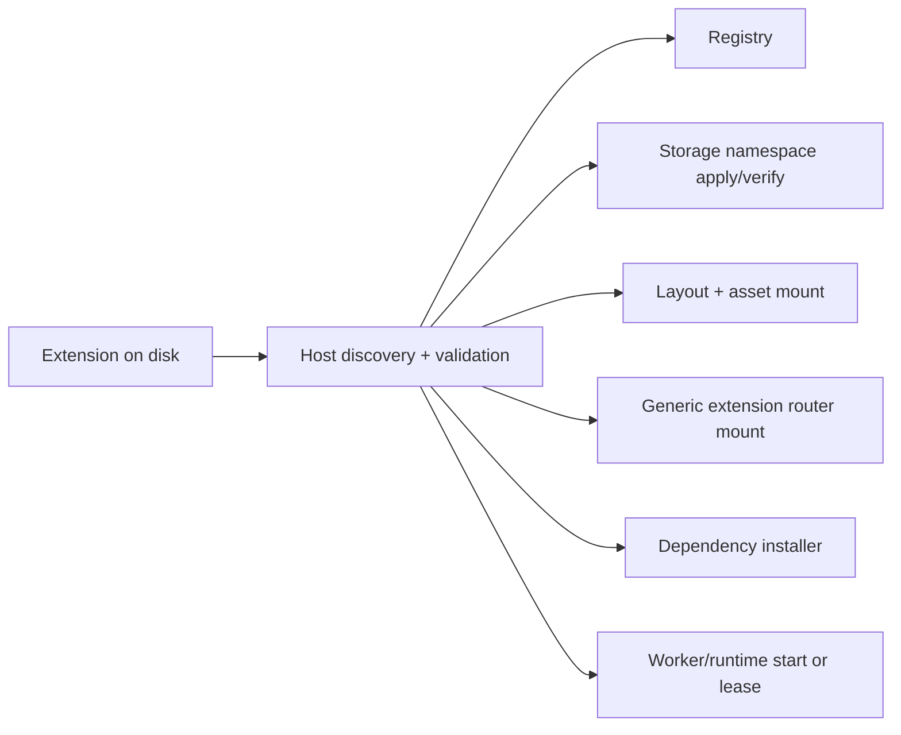
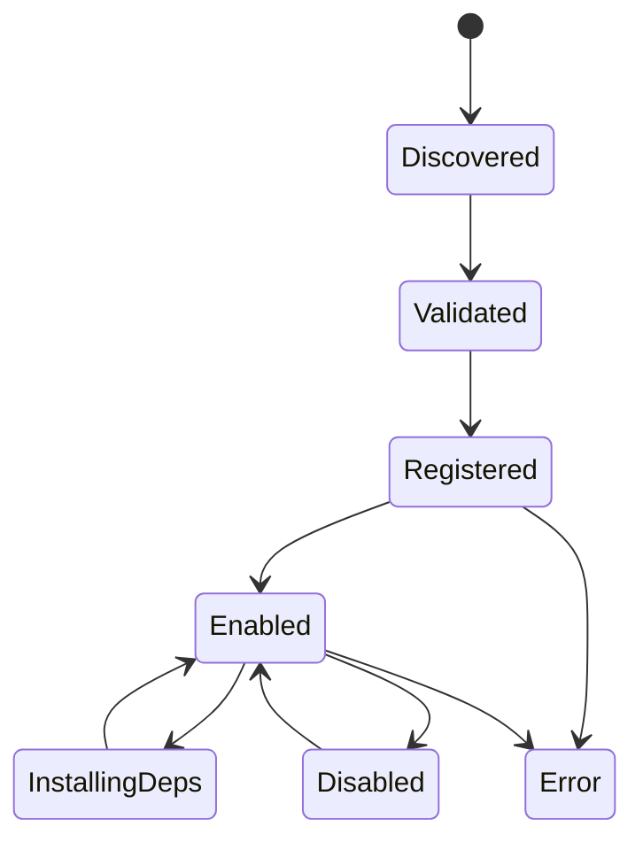

# 🔌 Extension Internals

This doc explains how extensions work in the repo today, with the host as the control authority.

## The Short Version

An extension can contribute:

- metadata and manifests
- operators and recipes
- optional storage migrations
- optional backend runtime declarations
- optional UI layouts, contributions, assets, and custom elements
- optional HTTP routes mounted under the generic host extension router

What it cannot do is bypass the host as the lifecycle owner.

## Current Extension Shape



## What A Modern Extension May Contain

| Surface | Examples in repo |
|---------|------------------|
| Manifest | every built-in extension |
| Operators / recipes | `local-llm`, `emotion-tts`, `ltx23`, `svi2-pro` |
| UI layouts | `local-llm`, `emotion-tts`, `ltx23`, `svi2-pro` |
| Static assets and custom elements | `emotion-tts`, `ltx23`, `svi2-pro` |
| Storage migrations | `local-llm`, `emotion-tts`, `ltx23`, `svi2-pro` |
| Backend runtime declarations | `local-llm`, `ltx23`, `longcat`, `svi2-pro` |

## Important Correction To Older Docs

Older repo docs described extension UI as metadata-only and said extensions did not ship frontend bundles.

That is no longer true as a general statement.

Current reality:

- some extensions still use host-rendered YAML layouts only
- some extensions also ship `web/dist` assets
- some extensions register custom elements that the host serves and mounts

Even in those cases, the host still owns:

- asset serving
- route mounting
- layout discovery
- lifecycle and validation

## Lifecycle



The exact internal states vary by subsystem, but the control pattern is consistent: extensions are discovered, checked, registered, and then activated through host-owned paths.

## Communication Paths

### 1. Manifest-driven contributions

The host reads:

- identity and compatibility
- dependency steps
- operators and recipes
- storage declarations
- UI declarations
- backend runtime manifests

### 2. Generic extension router

Extension HTTP surfaces are mounted under:

```text
/api/v1/extensions/{ext_id}/
/api/v1/extensions/{ext_id}/{*rest}
```

The host owns the server and mount point. The extension provides the router implementation.

### 3. Worker or runtime execution

Extensions either:

- run their own worker logic through host-managed processes, or
- consume host-managed backend runtime leases, or
- do both

This pattern is especially important in `nexus.local-llm` and the video extensions.

## Dependency Installation

The repo now uses explicit typed dependency graphs for built-in extensions instead of ad-hoc startup assumptions.

Typical steps include:

- `runtime`
- `package_set`
- `system_binary`
- `model_artifact`
- `validation`

The host walks those steps, reports progress, and decides success or failure.

## Storage Ownership

Extensions do not directly edit the host database schema imperatively.

Instead they declare storage contributions and the host:

1. derives a namespace
2. applies migrations
3. verifies compatibility
4. exposes status via host-owned APIs

This preserves extension isolation without surrendering database authority.

## Why Host Authority Matters

Without host authority, the platform would fragment into multiple special-case apps. With host authority, extensions stay composable:

- one lifecycle model
- one install story
- one API server
- one event system
- one artifact and runtime policy layer

## See Also

- [architecture.md](architecture.md)
- [extension-guide.md](extension-guide.md)
- [api-reference.md](api-reference.md)
- [database-schema.md](database-schema.md)
