# Architecture And Runtime

This document explains the runtime architecture of the ComfyUI-Trellis2 project inspected from:

```text
C:/Users/lazar/Downloads/ComfyUI-Trellis2-main (1).zip
```

Local extraction:

```text
.codex/scratch/comfyui-trellis2-main-1/ComfyUI-Trellis2-main
```

## High-Level Architecture

ComfyUI-Trellis2 wraps Microsoft TRELLIS.2 as a ComfyUI custom-node package. The package exposes both monolithic image-to-3D nodes and lower-level graph nodes that mirror internal generation stages.

```mermaid
flowchart LR
    Images["Input image(s)"] --> Pre["Preprocess / alpha / background"]
    Pre --> D3["DINOv3 image condition"]
    D3 --> SS["Sparse structure sampler"]
    SS --> Coords["Sparse coords"]
    Coords --> Shape["Shape SLAT sampler"]
    Shape --> Cascade["Optional cascade upscale"]
    Cascade --> Tex["Optional texture SLAT sampler"]
    Tex --> Decode["Decode latents"]
    Decode --> MeshVoxel["MeshWithVoxel"]
    MeshVoxel --> Trimesh["Trimesh / MeshLib / Open3D / CuMesh"]
    Trimesh --> Texture["Texturing / projection"]
    Texture --> Export["GLB / images / metadata"]
```



For NexusDNN, the important architectural lesson is the stage boundary, not ComfyUI itself. The host should expose a compact workflow operator while the Python worker preserves these internal phases for progress, cancellation, and future split-stage operators.

## Source Layout

| Path | Role |
| --- | --- |
| `__init__.py` | ComfyUI entry point importing `NODE_CLASS_MAPPINGS` and `NODE_DISPLAY_NAME_MAPPINGS`; references `WEB_DIRECTORY` in `__all__` without defining it. |
| `nodes.py` | 71-node ComfyUI API surface, model loader, generation nodes, split-stage nodes, mesh/texturing/projection utilities. |
| `pyproject.toml` | Package metadata: `trellis2`, version `1.0.25`, ComfyUI registry metadata, light dependencies. |
| `requirements.txt` | Minimal dependency list; incomplete for real runtime. |
| `README.md` | Install notes, model requirements, changelog, tested runtime, NATTEN/Pixal3D/Blackwell references. |
| `blackwell_fix.py` | Worker-local compatibility workaround and voxel-to-mesh fallback for Blackwell GPUs. |
| `reconviagen_pipeline.json` | Alternate pipeline config copied into the TRELLIS.2 model folder when ReconViaGen is enabled. |
| `trellis2/pipelines/trellis2_image_to_3d.py` | Main TRELLIS.2 pipeline: DINOv3 conditioning, sparse structure, shape SLAT, texture SLAT, cascade, multiview, decode, lazy load/unload. |
| `trellis2/pipelines/trellis2_texturing.py` | Existing-mesh texturing pipeline. |
| `projection/` | Multiview projection texturing and Blender rendering helpers. |
| `moge/` | MoGe camera/model code used by Pixal3D paths. |
| `vggt/` | VGGT/ReconViaGen code path. |
| `example_workflows/` | ComfyUI workflow examples for mesh-only, texturing, multiview, Pixal3D, projection, and refinement. |
| `wheels/` | Native wheel bundles for multiple Torch/Python/CUDA/platform profiles. |

## ComfyUI Registration

The custom node package registers through `__init__.py` and `nodes.py`.

`__init__.py`:

```python
from .nodes import NODE_CLASS_MAPPINGS, NODE_DISPLAY_NAME_MAPPINGS

__all__ = ["NODE_CLASS_MAPPINGS", "NODE_DISPLAY_NAME_MAPPINGS", "WEB_DIRECTORY"]
```

`nodes.py` defines 71 entries in `NODE_CLASS_MAPPINGS`. Each node class uses the standard ComfyUI structure:

- `INPUT_TYPES`
- `RETURN_TYPES`
- `RETURN_NAMES`
- `FUNCTION`
- `CATEGORY`
- optional `OUTPUT_NODE`

Potential issue: `WEB_DIRECTORY` appears in `__all__`, but no matching definition was found.

## Model Loading

`Trellis2LoadModel` is the main bootstrap node. It returns `TRELLIS2PIPELINE`.

Inputs:

| Input | Values/default | Meaning |
| --- | --- | --- |
| `modelname` | `microsoft/TRELLIS.2-4B`, `visualbruno/TRELLIS.2-4B-FP8`, `TencentARC/Pixal3D-T`; default `microsoft/TRELLIS.2-4B` | Model family. |
| `backend` | `flash_attn`, `xformers`, `sdpa`, `flash_attn_3`; default `flash_attn` | Attention backend. |
| `device` | `cpu`, `cuda`; default `cuda` | Execution device. |
| `low_vram` | boolean default `true` | Runtime memory behavior. |
| `keep_models_loaded` | boolean default `true` | Reuse loaded modules across nodes/runs. |
| `conv_backend` | `spconv`, `torchsparse`, `flex_gemm`; default `flex_gemm` | Sparse convolution backend. |
| `sparse_backend` | `xformers`, `flash_attn`; default `flash_attn` | Sparse attention backend. |
| `use_reconviagen` | boolean default `false` | Optional ReconViaGen/VGGT path. |

The node sets runtime environment and backend state:

- `OPENCV_IO_ENABLE_OPENEXR=1`
- `PYTORCH_CUDA_ALLOC_CONF=expandable_segments:True`
- `ATTN_BACKEND=<backend>`
- sparse attention backend
- sparse convolution backend

Then it calls:

```python
Trellis2ImageTo3DPipeline.from_pretrained(
    model_path,
    keep_models_loaded=keep_models_loaded,
    use_fp8=use_fp8,
    use_reconviagen=use_reconviagen,
    isPixal3D=isPixal3D,
)
```

## Model Artifacts

The loader relies on a ComfyUI-style model directory layout. NexusDNN should translate this into host-managed model artifacts.

| Asset | Required for | Source behavior |
| --- | --- | --- |
| `microsoft/TRELLIS.2-4B` | MVP default | Downloaded with `huggingface_hub.snapshot_download` if absent. |
| `visualbruno/TRELLIS.2-4B-FP8` | Optional FP8 | Uses `pipeline_fp8.json`; incompatible with ReconViaGen in source logic. |
| `TencentARC/Pixal3D-T` | Optional Pixal3D | Requires NATTEN/MoGe path; not compatible with ReconViaGen in source logic. |
| `facebook/dinov3-vitl16-pretrain-lvd1689m/model.safetensors` | Required | Source raises if missing. |
| `microsoft/TRELLIS-image-large/ckpts/ss_dec_conv3d_16l8_fp16.{json,safetensors}` | Required for non-Pixal3D sparse decoder | Source downloads direct files if missing. |
| `Stable-X/trellis-vggt-v0-2` files | Optional ReconViaGen | Source downloads VGGT/condition model files if ReconViaGen is enabled. |
| `Ruicheng/moge-2-vitl/model.pt` | Optional Pixal3D/MoGe | Source downloads if missing. |

Product requirement: normal worker execution must not rely on implicit network downloads. Install/validation steps should resolve these assets before a real runtime is marked healthy.

## Generation Stages

### Monolithic Generation

The simple path is exposed by:

- `Trellis2MeshWithVoxelGenerator`
- `Trellis2MeshWithVoxelAdvancedGenerator`
- `Trellis2MeshWithVoxelCascadeGenerator`
- `Trellis2MeshWithVoxelMultiViewGenerator`

These call `pipeline.run(...)` or related advanced variants and return:

- `MESHWITHVOXEL`
- `BVH`

Important controls include:

- seed
- `pipeline_type`: `512`, `1024`, `1024_cascade`, `1536_cascade`
- sparse/shape/texture step counts
- sampler: `euler`, `heun`, `rk4`, `rk5`
- max token budget
- max views
- sparse structure resolution
- texture SLAT toggle
- tiled decoder toggle
- hole filling controls

### Split-Stage Generation

The split-stage nodes map cleanly to future Nexus operators:

| Stage | ComfyUI node | Output |
| --- | --- | --- |
| Image conditioning | `Trellis2ImageCondGenerator` | `IMAGE_COND` at 512/1024, pipeline, optional MoGe camera config |
| Sparse structure | `Trellis2SparseGenerator` | `COORDS`, sparse resolution, pipeline |
| Shape SLAT | `Trellis2ShapeGenerator` | `SHAPE_SLAT`, resolution, pipeline |
| Shape cascade | `Trellis2ShapeCascadeGenerator` | higher-resolution `SHAPE_SLAT`, token count |
| Texture SLAT | `Trellis2TexSlatGenerator` | `TEXTURE_SLAT`, pipeline |
| Decode | `Trellis2DecodeLatents` | `MESHWITHVOXEL`, `BVH`, pipeline |

This is the right internal worker shape even if MVP only exposes `trellis2.generate_3d@1.0.0`.

### Multiview, Pixal3D, And ReconViaGen

Additional paths:

- explicit multiview condition/sparse/shape/cascade/texture nodes
- `Trellis2MoGeCameraConfig` and `Trellis2FovMoGeCameraConfig`
- Pixal3D image condition branches
- `Trellis2SparseGeneratorWithReconViaGen`
- `Trellis2ExtractImagesFromVideo`

These should be treated as P1/P2 product modes after the single-operator MVP is stable.

## Texturing, Projection, And Rendering

The package includes several post-generation workflows:

| Area | Role |
| --- | --- |
| `Trellis2MeshTexturing` | Texture existing mesh from image(s), returning textured mesh and PBR textures. |
| `Trellis2MeshTexturingMultiView` | Multi-view texturing. |
| `Trellis2MultiViewTexturing` | Projection-based texturing using nvdiffrast. |
| `Trellis2ProjectHighPolyToLowPoly` | Project detail/texture from high-poly mesh to low-poly mesh. |
| `Trellis2RenderMultiView` | Render views with Blender subprocess support. |
| `Trellis2RenderMultiViewNvdiffrast` | Render views with nvdiffrast. |
| `projection/texture_projection_multiview.py` | CUDA/nvdiffrast multiview projection logic. |
| `projection/blender_render.py` | Blender render helper. |

MVP should not require Blender/projection workflows unless explicitly promoted. They add binary dependencies and long-running execution phases.

## Dependency Profile

Declared dependencies:

| Package | Notes |
| --- | --- |
| `meshlib` | Mesh operations. |
| `requests` | Direct model file downloads. |
| `pymeshlab` | Mesh cleanup/simplification. |
| `opencv-python` | Image processing and inpainting. |
| `scipy` | Voxel/hole-fill operations. |
| `open3d` | Mesh processing. |
| `plotly` | Visualization support. |
| `trimesh` | Mesh representation/export. |
| `rembg` | Background removal. |

Actual runtime also requires:

- ComfyUI modules: `folder_paths`, `node_helpers`, `comfy.model_management`, `comfy.utils`
- PyTorch and CUDA
- Hugging Face Hub
- `cumesh`
- `o_voxel`
- `nvdiffrast`
- `nvdiffrec_render`
- `flex_gemm`
- optional `natten`
- optional Blender executable
- model weights listed above

NexusDNN should not import this stack in Rust/host code. Heavy imports belong in worker validation and worker execution only.

## Wheel Inventory

The archive includes local wheels for these profile groups:

| Group | Examples |
| --- | --- |
| `Windows/Torch270` | `cumesh`, `custom_rasterizer`, `flex_gemm`, `nvdiffrast`, `nvdiffrec_render`, `o_voxel` for cp311/cp312. |
| `Windows/Torch280` | Same core wheels plus `natten`; includes a `Blackwell/natten` wheel. |
| `Windows/Torch2100` | cp311/cp312 core wheels, plus a `CUDA 13.1` folder with cp311/cp312/cp313 variants and `natten`. |
| `Linux/Torch270` | cp312 wheels for core native packages. |
| `Linux/Torch291` | cp312 wheels for core native packages. |
| `Linux/Torch2110` | cp313 wheels for core native packages. |

Product requirement: every real runtime profile needs wheel hashes, provenance, license review, Python ABI validation, Torch/CUDA compatibility validation, import smoke, and GPU smoke.

## Blackwell Runtime Notes

`blackwell_fix.py` targets NVIDIA Blackwell / `sm_120` GPUs.

It:

- detects compute capability major `>= 12`
- sets `ATTN_BACKEND=sdpa`
- sets `SPARSE_CONV_BACKEND=spconv`
- sets `PYTORCH_CUDA_ALLOC_CONF=expandable_segments:True`
- monkey-patches `torch.cuda.get_device_capability`
- patches `cumm`/`spconv` compute capability detection
- replaces selected `flex_gemm` Triton kernels with PyTorch fallbacks
- provides CPU/scipy/skimage/trimesh voxel-to-mesh fallback helpers

Porting rule: this must be worker-local and profile-gated. The Nexus host must never apply these monkey patches globally. Prefer native CUDA 13.1 / Blackwell-compatible profile validation when possible.

## Nexus Port Boundary

| Layer | Owns |
| --- | --- |
| Rust/host | Extension manifest, runtime profile selection, workflow/recipe validation, artifact targets, cancellation routing, run events, UI mounting. |
| Python worker | TRELLIS.2 imports, model loading, DINOv3, CUDA kernels, mesh/texturing/rendering helpers, progress details, metadata, memory release. |
| Extension data | TRELLIS.2 operator IDs, workflow YAML, recipe projection, UI layout, model/runtime declarations. |

This keeps NexusDNN generic while allowing TRELLIS.2 to remain a specialized extension.
