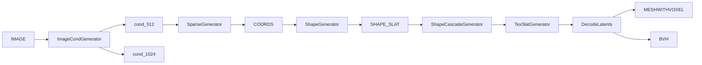

# ComfyUI TRELLIS.2 Node Surface

**Source archive:** `C:/Users/lazar/Downloads/ComfyUI-Trellis2-main (1).zip`

**Local extraction:** `.codex/scratch/comfyui-trellis2-main-1/ComfyUI-Trellis2-main`

**Purpose:** document the ComfyUI API surface exposed by ComfyUI-Trellis2 and translate it into NexusDNN porting requirements.

## Summary

`ComfyUI-Trellis2-main (1).zip` is a real ComfyUI custom-node package for Microsoft TRELLIS.2. It exposes a ComfyUI node registration surface through:

- `__init__.py`
- `nodes.py`
- `NODE_CLASS_MAPPINGS`
- `NODE_DISPLAY_NAME_MAPPINGS`
- Comfy-style node classes with `INPUT_TYPES`, `RETURN_TYPES`, `RETURN_NAMES`, `FUNCTION`, `CATEGORY`, and sometimes `OUTPUT_NODE`

The archive registers 71 node classes, all centered on `Trellis2Wrapper`. This node surface is the primary workflow reference for the NexusDNN TRELLIS.2 feature.

Important caveat: `__init__.py` lists `WEB_DIRECTORY` in `__all__`, but no `WEB_DIRECTORY` definition was found in the archive. That looks like a package-registration bug or leftover from a web UI bundle template.

## ComfyUI Registration Surface

`__init__.py`:

```python
from .nodes import NODE_CLASS_MAPPINGS, NODE_DISPLAY_NAME_MAPPINGS

__all__ = ["NODE_CLASS_MAPPINGS", "NODE_DISPLAY_NAME_MAPPINGS", "WEB_DIRECTORY"]
```

`nodes.py` defines:

```python
NODE_CLASS_MAPPINGS = {
    "Trellis2LoadModel": Trellis2LoadModel,
    ...
    "Trellis2RenderMultiViewNvdiffrast": Trellis2RenderMultiViewNvdiffrast,
}

NODE_DISPLAY_NAME_MAPPINGS = {
    "Trellis2LoadModel": "Trellis2 - LoadModel",
    ...
}
```

Each node class follows the standard Comfy pattern:

| Field | Meaning |
| --- | --- |
| `INPUT_TYPES()` | Declares required and optional node inputs. |
| `RETURN_TYPES` | Declares Comfy output types such as `TRELLIS2PIPELINE`, `MESHWITHVOXEL`, `TRIMESH`, `IMAGE_COND`, `COORDS`, `SHAPE_SLAT`, `TEXTURE_SLAT`, `BVH`, `IMAGE`, `STRING`, and `INT`. |
| `RETURN_NAMES` | Human-readable output port names. |
| `FUNCTION` | Method name invoked by Comfy, usually `process`. |
| `CATEGORY` | `Trellis2Wrapper`. |
| `OUTPUT_NODE` | Often `True`, even for intermediate-producing nodes. |

## Registered Node Inventory

The archive registers these 71 node IDs:

| Family | Node IDs |
| --- | --- |
| Load/runtime | `Trellis2LoadModel`, `Trellis2UnloadAllModels`, `Trellis2CudaReset` |
| Simple generation | `Trellis2MeshWithVoxelGenerator`, `Trellis2MeshWithVoxelAdvancedGenerator`, `Trellis2MeshWithVoxelCascadeGenerator`, `Trellis2MeshWithVoxelMultiViewGenerator` |
| Split-stage generation | `Trellis2ImageCondGenerator`, `Trellis2SparseGenerator`, `Trellis2ShapeGenerator`, `Trellis2ShapeCascadeGenerator`, `Trellis2TexSlatGenerator`, `Trellis2DecodeLatents` |
| ReconViaGen/VGGT | `Trellis2SparseGeneratorWithReconViaGen`, `Trellis2ExtractImagesFromVideo` |
| Explicit multiview stages | `Trellis2ImageCondMultiViewGenerator`, `Trellis2SparseMultiViewGenerator`, `Trellis2ShapeMultiViewGenerator`, `Trellis2ShapeCascadeMultiViewGenerator`, `Trellis2TexSlatMultiViewGenerator` |
| Pixal3D/MoGe camera config | `Trellis2MoGeCameraConfig`, `Trellis2FovMoGeCameraConfig`, `Trellis2ImagesToViewConfigs`, `Trellis2ViewConfigsToList`, `Trellis2ExtractViewConfigDetails` |
| Image/mesh loading | `Trellis2LoadImageWithTransparency`, `Trellis2PreProcessImage`, `Trellis2LoadMesh`, `Trellis2LoadImagesFromFolder` |
| Conversion/export | `Trellis2MeshWithVoxelToTrimesh`, `Trellis2TrimeshToMeshWithVoxel`, `Trellis2MeshWithVoxelToMeshlibMesh`, `Trellis2ExportMesh`, `Trellis2OvoxelExportToGLB`, `Trellis2SaveImage`, `Trellis2VoxelToMesh` |
| Mesh cleanup/remesh | `Trellis2SimplifyMesh`, `Trellis2SimplifyMeshAdvanced`, `Trellis2SimplifyTrimesh`, `Trellis2SimplifyTrimeshAdvanced`, `Trellis2PostProcessMesh`, `Trellis2PostProcess2`, `Trellis2PostProcessAndUnWrapAndRasterizer`, `Trellis2Remesh`, `Trellis2RemeshWithQuad`, `Trellis2ProgressiveSimplify`, `Trellis2ReconstructMesh`, `Trellis2ReconstructMeshWithQuad`, `Trellis2MeshRefiner`, `Trellis2FillHolesWithMeshlib`, `Trellis2FillHolesNicelyWithMeshlib`, `Trellis2FillHolesWithCuMesh`, `Trellis2SmoothNormals`, `Trellis2LaplacianSmoothingWithOpen3d`, `Trellis2WeldVertices`, `Trellis2BatchSimplifyMeshAndExport`, `Trellis2UnWrapTrimesh`, `Trellis2UnWrapAndRasterizer` |
| Texturing/projection/rendering | `Trellis2MeshTexturing`, `Trellis2MeshTexturingMultiView`, `Trellis2MultiViewTexturing`, `Trellis2ProjectHighPolyToLowPoly`, `Trellis2RenderMultiView`, `Trellis2RenderMultiViewNvdiffrast` |
| Graph utilities | `Trellis2Continue`, `Trellis2Continue3`, `Trellis2Continue4`, `Trellis2Continue5`, `Trellis2Continue6`, `Trellis2StringSelector`, `Trellis2MaxTokensCalculator` |

## Key Node: `Trellis2LoadModel`

`Trellis2LoadModel` is the runtime/model bootstrap node. It returns `TRELLIS2PIPELINE`.

Inputs:

| Input | Values/default | Porting meaning |
| --- | --- | --- |
| `modelname` | `microsoft/TRELLIS.2-4B`, `visualbruno/TRELLIS.2-4B-FP8`, `TencentARC/Pixal3D-T`; default `microsoft/TRELLIS.2-4B` | MVP should default to Microsoft 4B; FP8 and Pixal3D should be explicit profile/model choices. |
| `backend` | `flash_attn`, `xformers`, `sdpa`, `flash_attn_3`; default `flash_attn` | Runtime-profile setting. Should be set before importing heavy pipeline code. |
| `device` | `cpu`, `cuda`; default `cuda` | Real profile should require CUDA; fake profile avoids torch. |
| `low_vram` | boolean default `true` | Preserve in worker. |
| `keep_models_loaded` | boolean default `true` | Runtime memory/latency tradeoff. |
| `conv_backend` | `spconv`, `torchsparse`, `flex_gemm`; default `flex_gemm` | Native dependency and GPU compatibility risk. |
| `sparse_backend` | `xformers`, `flash_attn`; default `flash_attn` | Sparse attention dependency. |
| `use_reconviagen` | boolean default `false` | Optional advanced model path; incompatible with Pixal3D and FP8 in source logic. |

Side effects and dependencies:

- Sets `OPENCV_IO_ENABLE_OPENEXR=1`.
- Sets `PYTORCH_CUDA_ALLOC_CONF=expandable_segments:True`.
- Sets `ATTN_BACKEND`.
- Calls `config.set_backend`, `sparseconfig.set_attn_backend`, and `sparseconfig.set_conv_backend`.
- Downloads `modelname` with `huggingface_hub.snapshot_download` if missing.
- Requires `models/facebook/dinov3-vitl16-pretrain-lvd1689m/model.safetensors`.
- Copies `reconviagen_pipeline.json` into the TRELLIS.2 model folder if missing.
- Downloads `microsoft/TRELLIS-image-large` sparse decoder files if missing.
- Downloads ReconViaGen weights from `Stable-X/trellis-vggt-v0-2` when enabled.

NexusDNN should not do implicit worker downloads in normal execution. These assets should be declared as host-managed model/dependency steps.

## Generation Surfaces

### Monolithic Nodes

`Trellis2MeshWithVoxelGenerator` is the simpler image-to-mesh path. It accepts a pipeline, image, seed, pipeline type, step counts, token budget, max views, sparse structure resolution, texture toggle, tiled decoder toggle, sampler, and hole filling controls. It returns:

- `MESHWITHVOXEL`
- `BVH`

`Trellis2MeshWithVoxelAdvancedGenerator` adds detailed guidance controls:

- sparse/shape/texture guidance strengths
- guidance rescale values
- rescale timestep values
- guidance intervals
- sampler selection
- DINO lock/substep controls
- max tokens
- verbose mode
- Pixal3D/MoGe branches

`Trellis2MeshWithVoxelCascadeGenerator` and the multiview generator variants expose higher-resolution/cascade generation patterns.

### Split-Stage Nodes

The split-stage graph mirrors the internal TRELLIS.2 pipeline and is the best model for future advanced Nexus workflows:



Key stages:

| Node | Inputs | Outputs | Product implication |
| --- | --- | --- | --- |
| `Trellis2ImageCondGenerator` | pipeline, image, max views | `cond_512`, `cond_1024`, pipeline, optional MoGe config | Could become `trellis2.encode_image_condition` later. |
| `Trellis2SparseGenerator` | image condition, seed, sparse sampler controls, hole-fill controls, optional image/MoGe config | coords, sparse resolution, pipeline | Could become `trellis2.sample_sparse_structure` later. |
| `Trellis2ShapeGenerator` | condition, coords, 512/1024 resolution, shape sampler controls | shape SLAT, resolution, pipeline | Advanced user stage. |
| `Trellis2ShapeCascadeGenerator` | low-res shape SLAT, target resolution, token budget, sampler controls | higher-res shape SLAT, resolution, token count | Important for quality/performance tradeoff. |
| `Trellis2TexSlatGenerator` | condition, shape SLAT, resolution, texture sampler controls | texture SLAT, pipeline | Texture generation can be optional. |
| `Trellis2DecodeLatents` | shape SLAT, optional texture SLAT, tiled decoder | mesh, BVH, pipeline | Clean final stage boundary. |

MVP should probably not expose all of these as separate Nexus operators, but the worker should be internally structured around them so later split-stage operators are natural.

## Texturing, Projection, And Rendering

The archive includes multiple paths after mesh generation:

| Source area | Purpose |
| --- | --- |
| `Trellis2MeshTexturing` | Texture an existing mesh from image(s), with sampler and PBR outputs. |
| `Trellis2MeshTexturingMultiView` | Multi-view texture generation. |
| `Trellis2MultiViewTexturing` | Projection-based texturing using nvdiffrast. |
| `Trellis2ProjectHighPolyToLowPoly` | Project high-poly detail/texture to low-poly mesh. |
| `Trellis2RenderMultiView` | Render views with Blender subprocess support. |
| `Trellis2RenderMultiViewNvdiffrast` | Render views with nvdiffrast. |
| `projection/texture_projection_multiview.py` | CUDA/nvdiffrast multiview projection logic. |
| `projection/blender_render.py` | Blender render helper with GPU backend selection. |

Product implication: Nexus MVP should keep projection and Blender rendering as non-goals unless the feature explicitly needs multiview texture baking. They introduce separate binary/runtime dependencies and long-running phases.

## Pipeline Internals

`trellis2/pipelines/trellis2_image_to_3d.py` defines `Trellis2ImageTo3DPipeline`.

Important behavior:

- `from_pretrained` switches config files for ReconViaGen and FP8.
- DINOv3 model path is rewritten to `models/facebook/dinov3-vitl16-pretrain-lvd1689m`.
- Non-Pixal3D runs override `sparse_structure_decoder` to `models/microsoft/TRELLIS-image-large/ckpts/ss_dec_conv3d_16l8_fp16`.
- MoGe model `Ruicheng/moge-2-vitl` is downloaded/loaded for Pixal3D camera config.
- Lazy model load/unload methods exist for image conditioning, sparse structure, shape SLAT, texture SLAT, decoders, Pixal3D image-condition models, MoGe, and ReconViaGen/VGGT.
- `run` supports `512`, `1024`, `1024_cascade`, `1536_cascade`, and code paths for `2048_cascade` and `4096_cascade`, although the main simple node exposes only up to `1536_cascade`.
- `sample_sparse_structure` supports hole filling with `morphological_closing`, `flood_fill`, and `remove_small_holes`, plus `keep_only_shell`.
- Multiview variants exist for sparse, shape, cascade, and texture stages.

## Dependency Surface

Declared dependencies in `pyproject.toml`:

| Package | Notes |
| --- | --- |
| `meshlib` | Mesh operations. |
| `requests` | Direct model file downloads. |
| `pymeshlab` | Mesh cleanup/simplification. |
| `opencv-python` | Image processing and inpainting. |
| `scipy` | Voxel/hole-fill operations. |
| `open3d` | Mesh processing. |
| `plotly` | Visualization support. |
| `trimesh` | Mesh representation/export. |
| `rembg` | Background removal. |

Actual runtime dependencies also include:

- ComfyUI runtime modules: `folder_paths`, `node_helpers`, `comfy.model_management`, `comfy.utils`.
- PyTorch and CUDA.
- Hugging Face Hub.
- `cumesh`, `o_voxel`, `nvdiffrast`, `nvdiffrec_render`, `flex_gemm`.
- Optional `natten` for `TencentARC/Pixal3D-T`.
- Optional Blender executable for Blender rendering.
- Auxiliary model code under `moge/` and `vggt/`.

The top-level imports in `nodes.py` include many heavy native packages. A missing wheel can break node registration before any node is executed. Nexus should avoid importing this stack in the host process; all heavy imports belong inside the Python worker.

## Wheel Inventory

The archive includes local wheels for these platform/profile groups:

| Group | Examples |
| --- | --- |
| `Windows/Torch270` | `cumesh`, `custom_rasterizer`, `flex_gemm`, `nvdiffrast`, `nvdiffrec_render`, `o_voxel` for cp311/cp312. |
| `Windows/Torch280` | Same core wheels plus `natten`; includes a `Blackwell/natten` wheel. |
| `Windows/Torch2100` | cp311/cp312 core wheels, plus a `CUDA 13.1` folder with cp311/cp312/cp313 variants and `natten`. |
| `Linux/Torch270` | cp312 wheels for core native packages. |
| `Linux/Torch291` | cp312 wheels for core native packages. |
| `Linux/Torch2110` | cp313 wheels for core native packages. |

These wheels are useful evidence but not automatically product-ready. Nexus needs hashes, provenance, license review, and import/CUDA smoke tests per profile.

## Blackwell Findings

`blackwell_fix.py` is a drop-in workaround for NVIDIA Blackwell / `sm_120` GPUs.

It does all of the following:

- detects GPUs with compute capability major `>= 12`
- sets `ATTN_BACKEND=sdpa`
- sets `SPARSE_CONV_BACKEND=spconv`
- sets `PYTORCH_CUDA_ALLOC_CONF=expandable_segments:True`
- monkey-patches `torch.cuda.get_device_capability` to report Hopper-like `(9, 0)` for newer GPUs
- patches `cumm`/`spconv` compute capability detection
- replaces some `flex_gemm` Triton kernels with PyTorch fallbacks
- patches Pillow WebP capability flags
- provides CPU/scipy/skimage/trimesh voxel-to-mesh fallback helpers

Porting rule: do not apply these monkey patches in the Nexus host process. If needed, they must be worker-local, profile-gated, and reported in metadata. Prefer native CUDA 13.1 / Blackwell-compatible wheels when validation proves them stable.

## Nexus Portability Assessment

| Surface | Portability | Recommendation |
| --- | --- | --- |
| ComfyUI node class API | High as behavior reference, low as direct API | Convert to Nexus operators/recipe controls instead of embedding Comfy. |
| TRELLIS.2 Python pipeline | High | Keep mostly in Python worker with import isolation and host-managed model paths. |
| Native mesh/CUDA packages | Medium/high risk | Validate per runtime profile; keep out of host process. |
| Texturing/projection/rendering | Medium | Include only simple export/preview in MVP; defer Blender/projection workflows. |
| Pixal3D/MoGe | Medium | Treat as P1 advanced profile/model mode. |
| ReconViaGen/VGGT | Medium | Treat as P1/P2, because it adds model assets and video/image extraction flow. |
| Blackwell workaround | Medium | Useful, but profile-gate and prefer native profile validation. |

## PRD Implications

The PRD should target:

```text
extension id:     nexus.3d.trellis2
primary operator: trellis2.generate_3d@1.0.0
```

MVP should expose a simple image-to-3D recipe, not the full 71-node surface. The worker should internally retain the split-stage boundaries so future Nexus operators can map cleanly to:

- `trellis2.encode_image_condition`
- `trellis2.sample_sparse_structure`
- `trellis2.sample_shape_slat`
- `trellis2.cascade_shape_slat`
- `trellis2.sample_texture_slat`
- `trellis2.decode_latents`
- `trellis2.texture_mesh`
- `trellis2.render_multiview`

The workflow-driven recipe must bind controls through generic targets such as `input:images` and `node:generate_3d.config.seed`. TRELLIS.2 names belong in extension data and worker code, not Nexus host crates.
