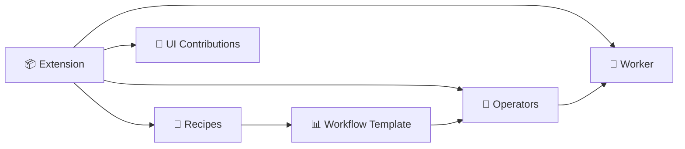

# 📋 Schemas Explained

Everything in nexus-dnn is described by YAML files that follow strict rules called **schemas**. This guide explains each one in plain language — no jargon, no Rust knowledge needed.

---

## 🎯 The Big Picture

Think of nexus-dnn like a workshop:

```text
📦 Extension    = a toolbox you install
🔧 Operator     = a single tool (becomes a "node" when placed in a workflow)
📊 Workflow     = operators wired together into a pipeline (the full circuit board)
📖 Recipe       = a friendly front panel for a workflow (hides the wiring)
🔌 UI Piece     = a label or button the toolbox adds to the workshop UI
```

The hierarchy is: **operators → workflows → recipes** (simple to complex, then back to simple for users).

```text
🔧 Operators         You build these (individual tools)
      ↓ wire together
📊 Workflow           Operators connected into a pipeline
      ↓ wrap with friendly UI
📖 Recipe             A simple form that drives the workflow
```

Each of these has a YAML file that tells nexus-dnn what it is, what it needs, and what it produces.

---

## 📦 Extension Manifest

**What is it?** The "ID card" for a toolbox. It tells nexus-dnn who made it, what's inside, and how to run it.

**File**: `manifest.yaml` at the root of every extension folder.

### What goes in it

| Field | What it means | Required? |
|-------|--------------|-----------|
| `spec_version` | Always `"0.1"` — tells nexus-dnn which format this file uses | ✅ |
| `extension.id` | A unique name like `acme.image.tools` (dots separate words, no spaces) | ✅ |
| `extension.version` | Version number like `1.0.0` | ✅ |
| `extension.name` | A friendly name like "Acme Image Tools" | Optional |
| `extension.description` | A short sentence about what it does | Optional |
| `extension.publisher` | Who made it | Optional |
| `compatibility.host_api` | Which nexus-dnn versions this works with (e.g., `">=0.1.0, <1.0.0"`) | ✅ |
| `compatibility.protocol` | Which communication protocol version it speaks | ✅ |
| `compatibility.platforms` | Operating systems it runs on (e.g., `["linux-x64", "windows-x64"]`) | Optional |
| `runtime.family` | What language the worker is written in: `python`, `native`, `builtin`, or `external_service` | ✅ |
| `runtime.entrypoint` | The file to run (e.g., `worker/main.py`) | ✅ |
| `runtime.environment` | Extra setup info like Python version | Optional |
| `capabilities` | Permissions it needs (e.g., `gpu.compute`, `filesystem.read`) | Optional |
| `operators` | List of operator files included (e.g., `[{file: "operators/resize.yaml"}]`) | Optional |
| `recipes` | List of recipe files included | Optional |

### Example

```yaml
spec_version: "0.1"

extension:
  id: "acme.image.tools"
  version: "1.0.0"
  name: "Acme Image Tools"

compatibility:
  host_api: ">=0.1.0, <1.0.0"
  protocol: ">=0.1.0, <1.0.0"

runtime:
  family: "python"
  entrypoint: "worker/main.py"

operators:
  - file: "operators/resize.yaml"
```

> 💡 **In plain English:** "I'm a toolbox called acme.image.tools, version 1.0.0. I work with nexus-dnn 0.1.x. I'm written in Python. Run worker/main.py to start me. I have one tool: resize."

---

## 🔧 Operator

**What is it?** A single tool that does one job — resize an image, convert to grayscale, generate text, etc. An operator takes inputs, has settings, and produces outputs.

**File**: Lives inside the `operators/` folder of an extension.

### What goes in it

| Field | What it means | Required? |
|-------|--------------|-----------|
| `spec_version` | Always `"0.1"` | ✅ |
| `operator.id` | Unique name like `image.resize` | ✅ |
| `operator.version` | Version like `1.0.0` | ✅ |
| `operator.display_name` | Friendly name like "Resize Image" | Optional |
| `operator.description` | What it does in one sentence | Optional |
| `operator.category` | Group it belongs to (e.g., "Image", "Audio") | Optional |
| `inputs` | What it needs to work — each has a `name`, `type`, and whether it's `required` | Optional |
| `outputs` | What it produces — each has a `name` and `type` | Optional |
| `config_schema` | Settings the user can change (as a JSON Schema) | Optional |
| `execution.mode` | How it runs: `"job"` (one-shot) or `"streaming"` | Optional |
| `execution.cacheable` | Can results be reused if inputs haven't changed? | Optional |
| `execution.resumable` | Can it pick up where it left off after a crash? | Optional |
| `resources.gpu` | Does it need a GPU? | Optional |
| `resources.min_vram_mb` | How much GPU memory it needs | Optional |
| `resources.cpu_cores` | How many CPU cores it wants | Optional |

### Example

```yaml
spec_version: "0.1"

operator:
  id: "image.resize"
  version: "1.0.0"
  display_name: "Resize Image"
  category: "Image"

inputs:
  - name: "image"
    type: "image/rgb"
    required: true

outputs:
  - name: "image_out"
    type: "image/rgb"

config_schema:
  type: object
  properties:
    width:
      type: integer
      minimum: 1
    height:
      type: integer
      minimum: 1
  required: [width, height]
```

> 💡 **In plain English:** "I'm a tool called Resize Image. Give me an image and tell me the width and height you want. I'll give you back a resized image."

### How inputs and outputs connect

Operators use **typed ports** — each input and output has a type like `image/rgb` or `text/plain`. When you wire operators together in a workflow, the types must match:

```text
[Resize] image/rgb ──→ image/rgb [Grayscale]    ✅ Types match
[Resize] image/rgb ──→ audio/wav [Transcribe]   ❌ Types don't match
```

Common types:

| Type | What it is |
|------|-----------|
| `image/rgb` | A color image |
| `image/grayscale` | A black-and-white image |
| `text/plain` | Plain text |
| `text/prompt` | A text prompt for AI |
| `audio/waveform` | Audio data |
| `video/encoded` | A video file |
| `scalar/integer` | A whole number |
| `scalar/float` | A decimal number |

---

## 📖 Recipe

**What is it?** A recipe is a pre-made workflow with a friendly interface. Instead of wiring operators together manually, a recipe gives users a simple form: "upload your image, pick a size, click run."

**File**: Lives inside the `recipes/` folder of an extension.

### What goes in it

| Field | What it means | Required? |
|-------|--------------|-----------|
| `spec_version` | Always `"0.1"` | ✅ |
| `recipe.id` | Unique name like `recipe.image.basic_transform` | ✅ |
| `recipe.version` | Version like `1.0.0` | ✅ |
| `recipe.display_name` | What users see: "Basic Image Transform" | ✅ |
| `recipe.summary` | One-line description | ✅ |
| `recipe.category` | Group like "Image" or "Audio" | ✅ |
| `recipe.thumbnail` | Path to a preview image | Optional |
| `recipe.input_summary` | Brief description of what the user needs to provide | Optional |
| `workflow_template` | Path to the workflow YAML this recipe uses | Optional |
| `bindings.fields` | Maps user-friendly field names to actual workflow inputs | Optional |

### Example

```yaml
spec_version: "0.1"

recipe:
  id: "recipe.image.basic_transform"
  version: "1.0.0"
  display_name: "Basic Image Transform"
  summary: "Resize and convert an image to grayscale."
  category: "Image"

workflow_template: "workflows/basic_transform.yaml"

bindings:
  fields:
    - field: "sourceImage"
      maps_to: "input:source_image"
    - field: "targetWidth"
      maps_to: "node:resize_1.config.width"
```

> 💡 **In plain English:** "I'm a recipe called Basic Image Transform. The user uploads a sourceImage and picks a targetWidth. Behind the scenes, I feed the image into the workflow's source_image input and set the resize node's width config."

### Recipe vs Workflow

A recipe does NOT wire recipes together. It wraps **one workflow** and exposes a simpler form.

| | Recipe | Workflow |
|---|--------|---------|
| **What it is** | A friendly form on top of a workflow | Operators wired together as a pipeline |
| **Who uses it** | End users | Power users / developers |
| **Interface** | Simple form with named fields | Full graph with nodes and edges |
| **Flexibility** | Limited to the bindings defined | Full control over everything |
| **Think of it as** | The front panel with 3 buttons | The full circuit board behind the panel |

```text
Recipe "Basic Image Transform"
  ┌─────────────────────────┐
  │  Upload Image: [____]   │  ← user sees this
  │  Width:        [512 ]   │
  │  Height:       [512 ]   │
  │  [ Run ]                │
  └────────────┬────────────┘
               │ maps to
  ┌────────────▼────────────────────────────────┐
  │  Workflow: source_image → resize → grayscale │  ← this runs
  └─────────────────────────────────────────────┘
```

---

## 🔌 UI Contribution

**What is it?** A small piece of metadata that tells the nexus-dnn frontend to show something extra — a special viewer for images, a button to run a recipe, a panel with extra info.

**File**: Lives inside the `ui/` folder of an extension.

### What goes in it

| Field | What it means | Required? |
|-------|--------------|-----------|
| `kind` | What type of UI piece this is (see table below) | ✅ |
| `id` | Unique identifier | ✅ |
| `display_name` | What the user sees | ✅ |
| `description` | Short explanation | Optional |
| `supported_types` | Which artifact types this handles (for viewers) | Optional |
| `priority` | Higher number = preferred over others (default 0) | Optional |
| `category` | Grouping category | Optional |
| `target` | Which operator or type this applies to | Optional |
| `target_type` | What kind of thing the target is | Optional |
| `invocation` | What happens when clicked (for commands) | Optional |
| `fallback` | What to use if this contribution isn't available | Optional |
| `metadata` | Any extra data the frontend might need | Optional |

### The 6 kinds

| Kind | Icon | What it does | Example |
|------|------|-------------|---------|
| `artifact_viewer` | 👁️ | Shows an artifact in a special way | Image preview for `image/rgb` files |
| `command` | ⚡ | A button or menu item the user can click | "Run Basic Transform" |
| `config_widget` | 🔧 | A nicer way to edit an operator's settings | A color picker instead of a text box |
| `inspector_panel` | 📋 | An extra info panel in the sidebar | Model metadata panel |
| `recipe_card` | 📦 | How a recipe looks in the catalog | Thumbnail + description card |
| `tool_metadata` | 🏷️ | Extra tags or icons for the tool catalog | Category badges |

### Example: Image Viewer

```yaml
kind: artifact_viewer
id: "image_viewer"
display_name: "Image Viewer"
supported_types:
  - "image/rgb"
  - "image/grayscale"
priority: 10
```

> 💡 **In plain English:** "When the user looks at an image/rgb or image/grayscale artifact, use me to display it. I'm pretty important (priority 10), so prefer me over the default viewer."

### Example: Command Button

```yaml
kind: command
id: "run_basic_transform"
display_name: "Run Basic Image Transform"
category: "Image"
invocation:
  recipe_id: "recipe.image.basic_transform"
```

> 💡 **In plain English:** "Add a button called 'Run Basic Image Transform' to the Image category. When clicked, start the basic_transform recipe."

---

## 📊 Workflow

**What is it?** A project plan that wires operators together into a pipeline. Data flows from inputs through operators to outputs — like an assembly line.

**File**: Can live anywhere, but usually inside an extension's `workflows/` folder or submitted via the API.

### What goes in it

| Field | What it means | Required? |
|-------|--------------|-----------|
| `spec_version` | Always `"0.1"` | ✅ |
| `workflow.id` | Unique identifier | ✅ |
| `workflow.version` | Version like `1.0.0` | ✅ |
| `workflow.title` | Friendly name | ✅ |
| `workflow.inputs` | What the workflow needs from the user (each has `name` and `type`) | Optional |
| `workflow.outputs` | What the workflow produces (each has `name` and `from`) | Optional |
| `stages` | Named groups for organizing nodes visually (each has `id` and `label`) | Optional |
| `nodes` | The operators wired together (this is the core) | Optional |

### Nodes — the heart of a workflow

Each node is one operator in action:

| Field | What it means | Required? |
|-------|--------------|-----------|
| `id` | Unique name within this workflow (e.g., `resize_1`) | ✅ |
| `operator` | Which operator to use, format: `operator_id@version` | ✅ |
| `stage` | Which stage this belongs to | Optional |
| `inputs` | Where each input port gets its data from | Optional |
| `config` | Settings for this operator | Optional |

### How data flows

Node inputs can get data in two ways:

| Syntax | What it means | Example |
|--------|--------------|---------|
| `from: "input:source_image"` | Use the workflow's input | User's uploaded image |
| `from: "resize_1:image_out"` | Use another node's output | Result from the resize step |
| `value: 512` | Use a fixed value | A hardcoded number |

### Example

```yaml
spec_version: "0.1"

workflow:
  id: "basic_image_transform"
  version: "1.0.0"
  title: "Basic Image Transform"

  inputs:
    - name: "source_image"
      type: "image/rgb"

  stages:
    - id: "prep"
      label: "Preparation"
    - id: "transform"
      label: "Transform"

  nodes:
    - id: "resize_1"
      operator: "image.resize@1.0.0"
      stage: "prep"
      inputs:
        image:
          from: "input:source_image"
      config:
        width: 512
        height: 512

    - id: "grayscale_1"
      operator: "image.grayscale@1.0.0"
      stage: "transform"
      inputs:
        image:
          from: "resize_1:image_out"

  outputs:
    - name: "result"
      from: "grayscale_1:image_out"
```

> 💡 **In plain English:** "Take the user's image, resize it to 512x512, then convert it to grayscale. Give back the grayscale image as the result."

### Visual flow

```text
User Image ──→ [ resize_1: Resize 512x512 ] ──→ [ grayscale_1: Grayscale ] ──→ Result
                    (Preparation stage)              (Transform stage)
```

---

## 🔗 How Everything Connects

```text
📦 Extension (manifest.yaml)
 ├── 🔧 Operators (operators/*.yaml)    ← the tools
 ├── 📖 Recipes (recipes/*.yaml)        ← the easy-mode instructions
 ├── 🔌 UI Contributions (ui/*.yaml)    ← buttons, viewers, panels
 ├── 📊 Workflows (workflows/*.yaml)    ← pipeline templates for recipes
 └── 🐍 Worker (worker/main.py)         ← the code that actually runs
```



When a user runs a recipe:
1. The **recipe** points to a **workflow template**
2. The **workflow** wires **operators** together
3. The **worker** executes each operator
4. **UI contributions** control how results are displayed

---

## 🔗 Related Documentation

| Document | What it covers |
|----------|---------------|
| [🔌 Extension Development Guide](extension-guide.md) | Step-by-step guide to building your own extension |
| [🔌 How Extensions Work](extension-internals.md) | Deep technical internals, lifecycle, protocol details |
| [🗄️ Database Schema](database-schema.md) | How all this data is stored |
| [📋 API Reference](api-reference.md) | How to query extensions, operators, recipes via HTTP |
| [🐍 Python SDK](python-sdk.md) | How to write the worker code |
