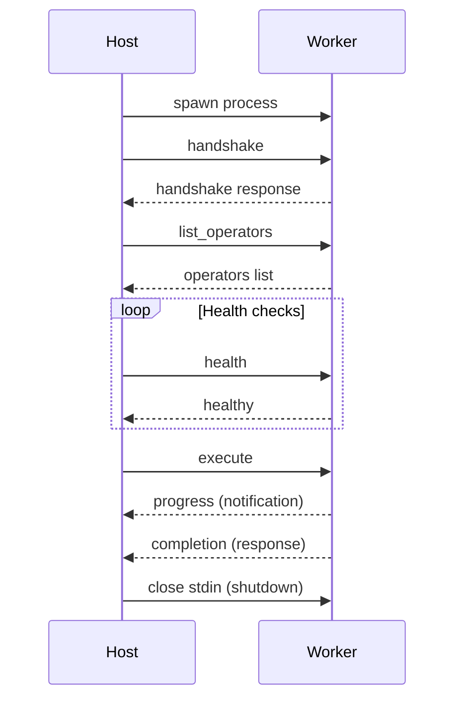

# 📋 Worker Protocol Reference

**Protocol version**: `0.1.0`  
**Transport**: JSON-RPC 2.0 over stdio (newline-delimited JSON)

The host spawns a worker process and communicates via its stdin/stdout streams. Each message is a single JSON object terminated by `\n`. stderr is reserved for unstructured diagnostic output.

---

## 🔄 Lifecycle



1. **Spawn** -- Host launches the worker binary/script based on `runtime.family` and `runtime.entrypoint` from the extension manifest.
2. **Handshake** -- Host sends protocol version; worker responds with its identity. A mismatch aborts the connection.
3. **Operator discovery** -- Host queries which operators this worker can execute.
4. **Steady state** -- Host dispatches `execute` requests and periodic `health` checks.
5. **Shutdown** -- Host closes stdin. Worker drains in-flight work and exits.

---

## 📋 Operations

### `handshake`

Negotiate protocol version and exchange identity.

**Request**

```json
{
  "jsonrpc": "2.0",
  "id": 1,
  "method": "handshake",
  "params": {
    "host_version": "0.1.0",
    "protocol_version": "0.1.0"
  }
}
```

**Response**

```json
{
  "jsonrpc": "2.0",
  "id": 1,
  "result": {
    "protocol_version": "0.1.0",
    "worker_name": "image-worker",
    "extension_id": "ai.nexus.image-preprocessor",
    "extension_version": "0.2.0"
  }
}
```

---

### `list_operators`

Enumerate operators this worker can execute.

**Request**

```json
{
  "jsonrpc": "2.0",
  "id": 2,
  "method": "list_operators",
  "params": null
}
```

**Response**

```json
{
  "jsonrpc": "2.0",
  "id": 2,
  "result": {
    "operators": [
      { "id": "resize_image", "version": "1.0.0" },
      { "id": "normalize_image", "version": "1.0.0" }
    ]
  }
}
```

---

### `validate_config`

Validate operator configuration before execution.

**Request**

```json
{
  "jsonrpc": "2.0",
  "id": 3,
  "method": "validate_config",
  "params": {
    "operator": { "id": "resize_image", "version": "1.0.0" },
    "config": { "width": 224, "height": 224 }
  }
}
```

**Response**

```json
{
  "jsonrpc": "2.0",
  "id": 3,
  "result": {
    "valid": true,
    "errors": []
  }
}
```

---

### `execute`

Run an operator. The worker may emit `progress` and `log` notifications during execution before sending the final response.

**Request**

```json
{
  "jsonrpc": "2.0",
  "id": 4,
  "method": "execute",
  "params": {
    "request_id": "req-001",
    "run_id": "run-a1b2c3d4",
    "node_id": "resize",
    "operator": { "id": "resize_image", "version": "1.0.0" },
    "config": { "width": 224, "height": 224 },
    "inputs": {
      "image": { "artifact_ref": "art-w0v9u8" }
    },
    "output_targets": {
      "resized": { "write_ref": "art-x1y2z3" }
    }
  }
}
```

**Progress notification** (worker -> host, no `id`)

```json
{
  "jsonrpc": "2.0",
  "method": "progress",
  "params": {
    "request_id": "req-001",
    "percent": 50,
    "message": "Resizing batch 2/4"
  }
}
```

**Log notification** (worker -> host, no `id`)

```json
{
  "jsonrpc": "2.0",
  "method": "log",
  "params": {
    "request_id": "req-001",
    "level": "info",
    "message": "Loaded model weights"
  }
}
```

**Response**

```json
{
  "jsonrpc": "2.0",
  "id": 4,
  "result": {
    "status": "completed",
    "outputs": {
      "resized": { "artifact_ref": "art-x1y2z3" }
    },
    "metrics": {
      "duration_ms": 1200
    }
  }
}
```

---

### `cancel`

Request cancellation of an in-flight execution. The worker sets a cancellation flag; the handler checks `context.is_cancelled` cooperatively.

**Request**

```json
{
  "jsonrpc": "2.0",
  "id": 5,
  "method": "cancel",
  "params": {
    "request_id": "req-001"
  }
}
```

**Response**

```json
{
  "jsonrpc": "2.0",
  "id": 5,
  "result": {
    "cancelled": true
  }
}
```

---

### `health`

Periodic liveness check.

**Request**

```json
{
  "jsonrpc": "2.0",
  "id": 6,
  "method": "health",
  "params": null
}
```

**Response**

```json
{
  "jsonrpc": "2.0",
  "id": 6,
  "result": {
    "status": "healthy"
  }
}
```

---

## ⚠️ Error Codes

| Code   | Meaning                   |
|:-------|:--------------------------|
| -32700 | Parse error               |
| -32600 | Invalid request           |
| -32601 | Method not found          |
| -32602 | Invalid params            |
| -32603 | Internal error            |
| -32000 | Validation error          |
| -32001 | Runtime dependency missing |
| -32002 | Model unavailable         |
| -32003 | Out of memory             |
| -32004 | Execution cancelled       |

**Error response example**

```json
{
  "jsonrpc": "2.0",
  "id": 4,
  "error": {
    "code": -32003,
    "message": "GPU out of memory: need 4GB, available 2GB"
  }
}
```

---

## 🔗 Related

- [Extension Guide](extension-guide.md)
- [Python SDK](python-sdk.md)
