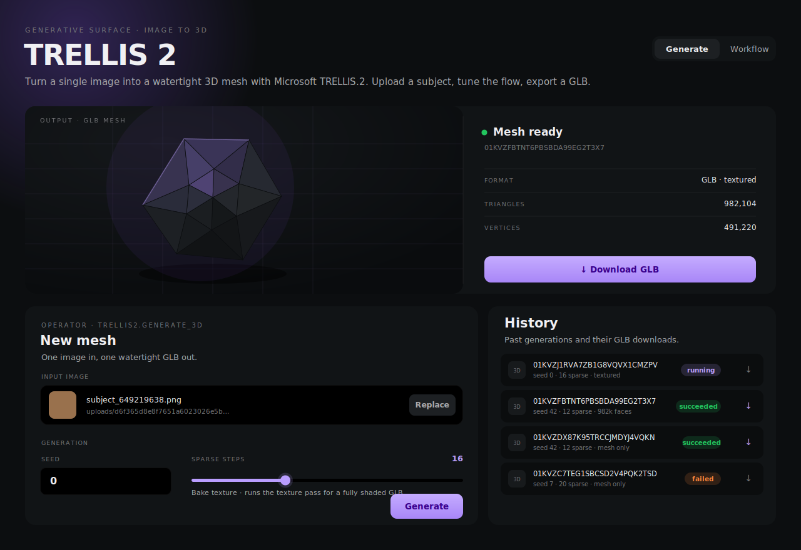

# trellis2 — Image → 3D (Microsoft TRELLIS.2) builtin extension

Single image → **watertight 3D mesh**, exported as a downloadable **GLB**. Ported from Microsoft
TRELLIS.2 (4B flow-matching over an O-Voxel sparse structure).

> Operator: `trellis2.generate_3d` · Extension id: `nexus.3d.trellis2`

## Status: live

Renders a real GLB **end-to-end** on the **DGX Spark (GB10, aarch64 Blackwell `sm_121`)** —
image → sparse structure → shape → mesh decode → optional texture pass → GLB export, with the
artifact served back through the host `/media` route. Frozen contracts:
[`…/2026-06-24-trellis2-P0.5-contracts.md`](../../../docs/research/comfyui-trellis2/2026-06-24-trellis2-P0.5-contracts.md);
proving run: [`…/2026-06-24-trellis2-P0-COMPLETE.md`](../../../docs/research/comfyui-trellis2/2026-06-24-trellis2-P0-COMPLETE.md).

## UI surface (Spectral Graphite)

The web bundle mounts as the `trellis2-app` custom element under the host's generic
`/extensions/:layoutId` route. The **Generate** surface pairs a persistent **3D preview stage**
with the generation form and a run history:



- **Preview stage** — interactive `<model-viewer>` (orbit, auto-rotate, neutral/ACES tone-mapping,
  exposure) shows the live mesh once a run completes, an atmospheric empty stage otherwise; a
  FORMAT / TRIANGLES / VERTICES readout and one-click GLB download sit alongside.
- **New mesh form** — input image, quality presets (Fast / Balanced / Max), seed, sparse + shape
  flow steps, triangle budget, residency, bake-texture toggle, and advanced per-stage guidance.
- **Progress** — live stage/step mirror of the worker. **History** — past generations with status
  chips and GLB downloads.

Build / verify the web bundle:

```bash
just ext-build trellis2                       # refresh committed web/dist from source
just web-verify extensions/builtin/trellis2/web   # tsc + biome lint (+ vitest)
```

## Proven runtime stack (build the worker against this)

torch 2.12.0+cu132 · py3.12 · `ATTN_BACKEND=flash_attn` · `transformers==4.56.0` · 4 native sm_121
kernels (`cumesh`, `flex_gemm`, `o_voxel`, `nvdiffrast`) vendored at
[`binaries/linux-aarch64/`](../../../binaries/linux-aarch64/) + vendored `flash_attn-2.8.3`.
dinov3 is gated (mirror fallback `kiennt120/…`); RMBG skipped (`rembg_model=None`, `preprocess_image=False`).

## Layout (mirrors svi2-pro)

- `manifest.yaml` — identity, deps, model_artifacts, backends (`gb10-flash` + `fake`), storage.
- `storage/migrations/001_generation_jobs.sql` — `ext_trellis2__generation_jobs`.
- `rust/` — `trellis2-extension` crate (router, dispatcher, lease, storage repo, `/media` route).
- `worker/` — `trellis2_worker` (stdio RPC + the TRELLIS.2 pipeline + `fake` backend).
- `web/` — extension bundle (Generate + Workflow surfaces, `<model-viewer>` preview, run history).
- `operators/generate_3d.yaml`, `recipes/`, `backends/{gb10-flash,fake}/versions.yaml`.

## Boundary

Extension-owned. No extension-id literals in host paths; the viewer lives here, not the host shell;
`crates/nexus-builtins` is the only host crate that may depend on `rust/`.
See [`.claude/rules/host-extension-boundary.md`](../../../.claude/rules/host-extension-boundary.md).
